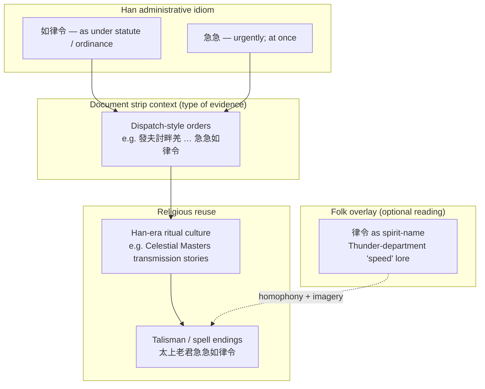

**Comprehensive Background History and Chinese Culture Reading on Hell’s Paradise (Japanese title 地獄楽 *dei6juk6 lok6*; English fandom title *Jigokuraku*): Taoist Roots, Historical Quests, Mystical Elements, and Alchemy**

> **For English readers (no background assumed)**  
> **What this is:** *Hell’s Paradise* is a **Japanese** comic and cartoon that borrows **Chinese history** (especially the **first empire of China**, the **Qin**, 3rd century BCE), **Taoist** ideas about the **Way** and **immortality**, and **East Asian** images of **“islands of the immortals.”**  
> **How Chinese appears here:** After an **English gloss**, we give **Chinese characters in Traditional (正體 / 繁體)** plus **Cantonese pronunciation in *Jyutping*** (the usual Hong Kong–style romanization), e.g. **First Emperor of Qin** (秦始皇 *ceon4 ci2 wong4*). **Japanese** forms used in the manga—**title**, **island names**, **読み**, **カタカナ** (*Tao* タオ, etc.)—are added **alongside** the Chinese when they help identify the same thing in **Japanese editions** (anime, tankōbon, [official glossary](https://www.jigokuraku.com/glossary/)). We **do not** use **Mandarin Hanyu Pinyin** in new glosses; a few **older book titles** in libraries may still be cited in their familiar **Wade–Giles** English forms (*Dao De Jing*, *I Ching*).  
> **Rule of thumb:** If you see **roman letters in italics** next to **漢字**, read them as **Cantonese**; the **characters** are the stable spelling. **One concept** may appear as **English + 繁體 + Japanese**—see the **Glossary cross-reference** at the end.

**Hell’s Paradise** (*Jigokuraku*; Japanese title 地獄楽 *dei6juk6 lok6*) is a Japanese manga and anime series deeply rooted in Chinese history, mythology, and Taoist thought. While set against the backdrop of Edo-period Japan, its core lore draws heavily from ancient Chinese quests for immortality, the figure of **Xu Fu** (徐福 *ceoi4 fuk1*)—a name sometimes garbled in transcription into **different characters** with a similar sound (除福 *ceoi4 fuk1* is one such mistake and is **not** the historical person)—and the cultural practices of **Taoism** (philosophical 道家 *dou6 gaa1* / religious 道教 *dou6 gaau3*) and **geomancy**. The mysterious island of **Kotaku** (Japanese **こたく** *Kotaku*; same setting is **Shinsenkyō** 神仙郷 *sin1 sin1 hoeng1* — **神仙** *san1 sin1* “immortals”; **郷** *hoeng1* “land / village”; English glosses such as **“Land of the Immortals”**) functions as a hellish reimagining of the legendary **Isles of the Blessed**, blending paradise and peril in a way that echoes classical Chinese tales of elixirs and eternal life. The story also reimagines that lure as a nightmarish cycle—abundant qi and natural harmony twisted into suffering when the quest for perfect immortality is pushed too far.

This document compiles every detail discussed across our conversation into one cohesive, logically organized reference. It expands on the historical Xu Fu expeditions, the **First Emperor of Qin**’s fate, the evolution of Taoism, **Taiji** “supreme ultimate” (太極 *taai3 gik6*) and *Book of Changes* cosmology (**two modes → four images → eight trigrams → sixty-four hexagrams**), plus **易經**-style **divination**: the **received 周易** oracle versus **lost** early **Yi** texts (**連山**, **歸藏**), the **Ten Wings** commentaries (**繫辭**, **文言**, **說卦**, **序卦**, **雜卦**, with **彖傳** / **象傳**), and how casts were **read** in practice; then the **Five Elements** (五行 *ng5 hang4*), **feng shui** (風水 *fung1 seoi2*) and **kan yu** (堪輿 *ham1 jyu4*), Taoist **external alchemy** (外丹 *ngoi6 daam1*; *waidan*) ritual practice (especially **Taiqing**-style sequences), **internal alchemy** (內丹 *noi6 daam1*; *neidan*) (including **zhoutian** 周天 *zau1 tin1* as **microcosmic circulation** and its afterlife in **Chinese martial-arts fiction**), **direct comparison** of both branches to the manga’s **Tan** elixir-pellet (丹 *daam1*) and **Tao (タオ)** systems, and how these ideas manifest in **Lord Tensen** (天仙 *tin1 sin1*). **Chinese characters** appear next to **Cantonese *Jyutping*** wherever a romanization is used (see the note above). **Illustrations** from **Wikimedia Commons** (and one **Wellcome** reproduction on Commons) appear **inline** where each topic is discussed; preview URLs use **500px** thumbnails, a **Wikimedia-standard** width (custom widths such as 400px are rejected by their servers — see [Common thumbnail sizes](https://w.wiki/GHai)). Captions link to each **file page** for license and attribution. **Appendices** after the conclusion discuss **Kishikai (鬼尸解)** vs Taoist **尸解**, **Lord Tensen** vs the **Eight Immortals (八仙)**, **Banko** vs **盤古 (Pangu)**, the **Hong Kong epilogue** (**雙龍過江** / **雙龍之道**), and **Appendix E** (**辟餌服生の斎** vs **服餌辟穀**—a **possible** Taoist **yangshēng** echo, **not** author-confirmed). **§3a** treats **Taoist talismans (符)** and the phrase **太上老君急急如律令**, including a **Han-document → charm** genealogy (**mermaid** diagram) and a **linked** Chinese **popular-press** summary of **急急如律令**. A **Glossary** at the end gathers definitions in one place.

### 1. Historical context: the **First Emperor of Qin**’s immortality obsession and **Xu Fu**’s elixir voyages

#### Xu Fu’s elixir quest (explorer **Xu Fu** 徐福 *ceoi4 fuk1*)

**Xu Fu** (徐福 *ceoi4 fuk1*; Japanese **徐福** *Jofuku* / **ジョフク**) was a **fangshi** (方士 *fong1 si6*)—roughly, an **alchemist, magician, and court ritual technician**—from the former state of **Qi** (齊 *cai4*, a large kingdom on the **Shandong** coast). That region sat in the **late Eastern Zhou** and **Warring States** period (戰國 *zin3 gwok3*, “warring states,” 5th–3rd c. BCE) before **Qin** unified China. Xu Fu is the **central historical figure** whose **sea voyages** inspired the manga’s premise (*Jigokuraku*). **First Emperor of Qin** (秦始皇 *ceon4 ci2 wong4*, r. as emperor **221–210 BCE**) sent him east to find **immortal elixir** (仙丹 *sin1 daan1*, literally “immortal pellet,” 仙 *sin1* + 丹 *daam1*) or a **never-aging drug** (長生不老藥 *coeng4 sang1 bat1 lou5 joek6*). Xu Fu **never returned**, symbolizing the court’s **obsessive, futile** chase for **life without death**.

#### Historical records: ***Records of the Grand Historian*** (*Shiji* 史記 *si2 gei3*)

The primary source is **Sima Qian** (司馬遷 *si1 maa5 cin1*, c. 145–c. 86 BCE), **Grand Astrologer–Historian (太史令)** at the **early Western Han** court, whose ***Records of the Grand Historian*** (*Shiji* 史記 *si2 gei3*) is widely regarded as **China’s first great synthetic narrative history**—spanning **legendary antiquity through his own lifetime**—and as the **model of scope and critical method** for **two millennia** of later **dynastic histories**. Key entries appear in the **“Basic Annals of the First Emperor of Qin”** (秦始皇本紀 *ceon4 ci2 wong4 bun2 gei3*).

In **219 BCE** and again around **210 BCE**, **First Emperor of Qin** (秦始皇 *ceon4 ci2 wong4*, 259–210 BCE) dispatched **Xu Fu** with a massive fleet—including thousands of young boys and girls, artisans, and supplies—to sail eastward in search of **Penglai** isle (蓬萊 *paang4 loi4*), **Fangzhang** isle (方丈 *fong1 zoeng6*), and **Yingzhou** isle (瀛洲 *jing4 zau1*). These were mythical realms inhabited by **immortals** (仙 *sin1*) who possessed the **elixir of life**. Xu Fu never returned. Later legends claim he reached **Japan** (sometimes **Fusang** (扶桑 *fu4 song1*)), introduced Chinese culture, and became associated with figures such as **Emperor Jimmu** and wider **early Japanese imperial lineage myths**. Memorials and shrines (for example near **Kumano** or **Mount Fuji**, sometimes identified with **Penglai**) honor him as a **cultural founder or sage** as well as an explorer.

**First expedition (219 BCE, 28th year of the First Emperor’s reign):** Xu Fu and other men from **Qi** (齊 *cai4*, ancient Chinese state)—the **same former eastern kingdom** (see above)—petitioned the emperor, claiming that three divine mountains/islands existed in the eastern sea—Penglai, Fangzhang, and Yingzhou—inhabited by **immortals** (仙 *sin1*) who possessed the elixir. They requested to purify themselves through fasting and rituals, then sail with **unmarried boys and girls** (純潔的童男童女 *seon4 git3 dik1 tung4 naam4 tung4 neoi5*, literally “pure” children offered as tribute) as tribute or attendants to the immortals. The emperor approved, dispatching several thousand young people (accounts vary slightly on exact numbers, often cited as several hundred to thousands). The fleet included provisions and aimed to reach the immortals, sometimes linked to the legendary magician **Anqi Sheng** (安期生 *on1 kei4 sang1*), said to be over **1,000 years old**. Xu Fu returned empty-handed, claiming giant sea creatures (大魚 *daai6 jyu4*) blocked the path and requesting **archers or crossbowmen** for defense.

**Second expedition (around 210 BCE):** During the emperor’s eastern tour to **Langya** (琅琊 *long4 je4*, modern Shandong), Xu Fu reappeared and requested even greater resources. The emperor approved a far more ambitious expedition. The fleet reportedly included **3,000 virgin boys and 3,000 virgin girls**—**some accounts instead give several thousand youths in total**—(童男童女 *tung4 naam4 tung4 neoi5*), often chosen for **“pure” yang essence**, commonly glossed as **virginity / lack of sexual experience**, seen as ideal **offerings or assistants in alchemical rites**), hundreds of skilled artisans and craftsmen (百工 *baak3 gung1*), seeds of the five grains (五穀種子 *ng5 guk2 zung2 zi2*), medicinal herbs, provisions, and large multi-decked ships (possibly up to **60 barques**). The goal remained obtaining the elixir from the immortals, **sometimes linked to Anqi Sheng** (安期生 *on1 kei4 sang1*). Xu Fu claimed obstacles like sea monsters; after departure from Langya, he vanished forever. Later legends state he reached a **“vast plain and wide marshes”** (平原廣澤 *ping4 jyun4 gwong2 zaak6*), declared himself king, and never returned—interpreted by many as landing in **Japan** (or ancient Fusang). **Legends in both China and Japan** claim Xu Fu introduced **advanced knowledge** (agriculture, medicine, metallurgy, writing) to the Japanese archipelago.

#### Context in Taoist mysticism and **external alchemy** (外丹 *ngoi6 daam1*)

The First Emperor’s obsession stemmed from **fangshi** (方士 *fong1 si6*) practices already active in the **late Warring States and Qin** periods, drawing on emerging Taoist ideas: harmony with **the Way** (道 *dou6*), **qi** vital energy (氣 *hei3*), **yin–yang** (陰陽 *jam1 joeng4*) balance, and the **Five Elements** (五行 *ng5 hang4*). The emperor consumed various **alchemical preparations** (often **cinnabar** (朱砂 *zyu1 saa1*), mercury, lead, and herbs) hoping to become **an immortal** (仙 *sin1*) himself—a **Taoist immortal**, i.e. a figure **fangshi** (方士 *fong1 si6*) lore treated as having **transcended ordinary death**—likely contributing to his **death in 210 BCE**, **the same year** as Xu Fu’s final departure; for the evidence and irony of **mercury poisoning**, see **§2** below.

The quest for a true **elixir** (丹 *daam1*) was tied to **external alchemy** (*waidan* 外丹 *ngoi6 daam1*)—though **formalized texts and detailed rituals** developed more fully in the **early Western Han** (西漢 *sai1 hon3*, from **206 BCE**) and later (e.g. the **Taiqing** (太清 *taai3 cing1*) tradition from the **3rd–4th centuries CE** onward). (The **Han** imperial era (漢朝 *hon3 ciu4*; **漢** *hon3*) as a whole spans **206 BCE–220 CE**, conventionally split into **Western / Former Han** (西漢 *sai1 hon3*, **206 BCE–9 CE**) and **Eastern / Later Han** (東漢 *dung1 hon3*, **25–220 CE**).) In Xu Fu’s era, practice involved **ritual purification**, **fasting**, **geomantic site selection** (early **feng shui** principles), and **compounding** substances believed to **concentrate vital qi** and grant **longevity or transcendence**. The inclusion of **artisans** and **grain seeds** has often been read as **practical preparation for settlement or colonization** if the immortal isles proved **real and inhabitable**, not only as ritual freight.

Collectively, the **three islands** belong to broader Chinese mythology as the **Isles of the Blessed** or **Penglai fairyland (蓬莱仙境)**—**floating** or **mist-shrouded** realms of **eternal life**, **peaches of immortality** (蟠桃 *pun4 tou4*), and **Taoist immortals**, where **the Way** (道 *dou6*) was imagined to flow **perfectly**, **free from earthly decay**.

#### *Hell’s Paradise*: Kotaku’s **three nested regions** and the classical **three peaks**

In official **Japanese-language** materials for *Hell’s Paradise*, the island **Shinsenkyō** (神仙郷 *sin1 sin1 hoeng1*; also **Kotaku**) is partitioned into **three concentric zones** whose names **reuse the very toponyms** Xu Fu’s fleet was sent to find—here rearranged as **rings** from **outer shore** to **inner palace**:

| In-story region (romanization) | Characters (繁體; same in JP manga materials) | Japanese reading | Classical “eastern sea” echo (§1) | Narrative role ([official glossary](https://www.jigokuraku.com/glossary/)) |
| -------------------------------- | ---------------------- | ------------------ | ------------------------------------------------------ | ---------------------------------------- |
| **Eishū** | **瀛州** | *Eishū* えいしゅう | Echo of **Yingzhou** (**瀛洲** *jing4 zau1* in **Shiji**-style lists; the island materials use **州** *zau1* rather than **洲** *zau1*). | **Outer** ring—**gate gods** (門神 *monshin*), **venomous vermin**, harshest approaches. |
| **Hōjō** | **方丈** | *Hōjō* ほうじょう | **Fangzhang** (方丈 *fong1 zoeng6*)—the **middle** peak in **Records of the Grand Historian** lore. | **Middle** band—**Hōko** (木人 *mokujin*) and **Zaoshen** (竈神 *kamado-gami*)-style beings. |
| **Hōrai** | **蓬莱** | *Hōrai* ほうらい | **Penglai** (蓬萊 *paang4 loi4*)—chief immortal isle in Chinese tradition. | **Inner** core—**Lord Tensen** citadel and the supposed **Elixir of Life** (仙藥 *sin1 joek6*; JP **仙薬** *sen'yaku*). |

So the fiction does not merely **mention** **Penglai** (蓬萊 *paang4 loi4*): it makes **蓬莱** the **name of the inner sanctum**, while **方丈** and **瀛**-wording echo the **other two peaks** of the **triad** the **First Emperor** funded Xu Fu to reach.

**道士 (Dōshi)** in the manga is spelled with the same characters Chinese uses for a **Taoist priest** or adept (**道士** *dou6 si6*; literally “**Way**-**master** / **Dao** **scholar**”). In *Hell’s Paradise*, **dōshi** are **disciples directly under the Tensen**, with **clear will and intelligence**; they study the **five inner-alchemy-style disciplines** on the path toward higher **immortal** ranks (official glossary: progression **道士 → 地仙 → 上仙 → 神仙 → 天仙**). That is a **lexical borrowing** from religious Taoism for a **fiction-specific hierarchy**—not a claim that historical **Qin** courts used the word in exactly this **game-like promotion ladder**.

#### *Hell’s Paradise*: Xu Fu as the historical catalyst

In the manga/anime, **Xu Fu** (**徐福** *Jofuku* / *Jo-fuku*) is the **historical catalyst** who reaches the island **centuries earlier**—a **twisted** version of **Shinsenkyō** (神仙郷 *sin1 sin1 hoeng1*; JP **神仙郷** *Shinsenkyō*) and/or **Penglai** (蓬萊 *paang4 loi4*). **Failing to find a natural elixir**, his wife **Rien** (蓮 *lin4*, lotus; character **蓮** *Ren* / **リエン** *Rien* in Japanese editions) uses **forbidden Taoist knowledge** and **Flower Tao** (花タオ *faa1* + katakana **タオ** *Tao*) to create the **Lord Tensen** (天仙 *tin1 sin1*; JP **天仙** *tensen*) as **artificial immortals**. For those who come after, the **true “Elixir of Life”** sought by expeditions and court ambition becomes **Tan** (丹 *daam1*; JP **丹** *tan*)—a **refined substance** distilled from **harvested human (or creature) Tao / life-force** (氣 *hei3*; JP same graph **氣** *ki*) through **arborification** (JP **花化** *keka*, “flower transformation,” [official glossary](https://www.jigokuraku.com/glossary/)). That **parodies historical waidan**: instead of mineral/herbal compounding in **ritual crucibles**, the Tensen run a **hellish production cycle**, turning living beings into **concentrated essence** to **sustain and perfect immortality**. The island embodies the **dangerous allure of Penglai**—**abundant qi** and natural harmony **twisted** into a **quest for perfect immortality gone horribly wrong**, **suffering**, and **hubris**—geomantically rich in qi, yet a cautionary mirror when harmony is disrupted.

Xu Fu’s quest **encapsulates the double-edged sword** of Taoist pursuit: a **genuine philosophical search for harmony with the Way** (道 *dou6*), **distorted** by **imperial desperation** and **alchemical overreach**. It warns that **forcing immortality**—whether through **pills**, **rituals**, or the manga’s **Tan**—**disrupts natural cycles**, turning **paradise into hell**. The expedition remains **one of history’s great unsolved mysteries**, blending **fact**, **fangshi** (方士 *fong1 si6*) lore, and **enduring cultural symbolism**.

### 1a. Taoism (道家/道教) in the Qin Dynasty Era

**Taoism**—both the **philosophical school** (道家 *dou6 gaa1*) and the **emerging religious / immortality-seeking tradition** (道教 *dou6 gaau3*)—was already influential by the **Qin dynasty (221–206 BCE)**. Philosophical foundations from **Laozi** (老子 *lou5 zi2*) and **Zhuangzi** (莊子 *zong1 zi2*) emphasized living in harmony with **the Way** (道 *dou6*), the natural flow of the universe, **yin–yang** (陰陽 *jam1 joeng4*) balance, and the **Five Elements** (五行 *ng5 hang4*: wood, fire, earth, metal, water). At the practical level, **fangshi** (方士 *fong1 si6*, “masters of techniques”)—alchemists, diviners, and magicians—served the court and pursued **external alchemy** (外丹 *ngoi6 daam1*; *waidan*) to create elixirs of immortality using **herbs, minerals, and esoteric practices**. **The First Emperor’s obsession with immortality** was fueled by these fangshi; he sponsored expeditions, built **palaces aligned with cosmic principles**, and even sought to become **an immortal** (仙 *sin1*) himself. **Organized religious Taoism** formalized later (notably in the **Eastern Han** (東漢 *dung1 hon3*)), but the **core ideas**—**qi** (氣 *hei3*, vital energy), immortality through cultivation, and harmony with nature—were **fully present when Xu Fu set sail**.

The **Lord Tensen** (天仙 *tin1 sin1*; JP **天仙** *tensen*, literally “**heaven**-**immortal**”) embody the **highest rank of “mountain immortals”** (仙人 *sin1 jan4*; JP **仙人** *sennin*) in the story’s Taoist-inspired hierarchy. They have achieved **near-perfect mastery of Tao** through **rigorous training**, granting **regeneration**, **elemental manipulation**, **gender fluidity** (including **switching yin-yang affinities**), and **god-like power**. Translating “Tensen” as **“adeptus”** is apt—it parallels the **immortal cultivator-adepts** (仙 *sin1*) in other Chinese-inspired media, emphasizing their role as **transcendent beings who have surpassed mortal limits through Taoist cultivation** rather than as mere “heavenly immortals” in a shallow sense.

### 2. **First Emperor of Qin** — mercury and the elixir (秦始皇 *ceon4 ci2 wong4*)

**First Emperor of Qin** (秦始皇 *ceon4 ci2 wong4*, 259–210 BCE), the **First Emperor** who **unified China** and founded the **Qin** dynasty (秦朝 *ceon4 ciu4*), died at **age 49** (or around **50** by some reckonings) during an **eastern inspection tour** in **210 BCE** at **Shaqiu Palace** (沙丘宮 *saa1 jau1 gun1*, Hebei)—the **same year** as **Xu Fu** (徐福 *ceoi4 fuk1*)’s final departure. While **ancient texts do not supply an explicit, autopsy-like account** of his cause of death, the **prevailing historical and scholarly interpretation**—supported by **later records**, **patterns among Chinese emperors**, and **modern archaeological evidence**—is **chronic mercury poisoning** from **long-term consumption** of alchemical **elixirs** (丹 *daam1*) meant to grant **immortality**.

This **ironic outcome** belongs to the same **Taoist-inspired quest for immortality** that drove his sponsorship of Xu Fu’s **maritime expeditions** toward the **Isles of the Immortals** (**Penglai** 蓬萊 *paang4 loi4* and the other peaks) and the **true elixir of life** (長生不老藥 *coeng4 sang1 bat1 lou5 joek6*). When those **voyages failed to deliver quick results**, the emperor leaned harder on court **fangshi** (方士 *fong1 si6*)—alchemists and masters of esoteric techniques—for **immediate** answers through **external alchemy** (外丹 *ngoi6 daam1*).

#### The role of **mercury** (水銀 *seoi2 ngan4*) and **cinnabar** (朱砂 *zyu1 saa1*) in **external alchemy** (*waidan*)

In **early Taoist and fangshi** practice (already active in the **late Warring States** and **fully employed in the Qin era**), **mercury** was a **prized** substance, commonly obtained by heating **cinnabar** (朱砂 *zyu1 saa1*)—bright red **mercuric sulfide**. Alchemists treated mercury’s **liquid, silvery, seemingly “eternal”** behavior at room temperature as symbolic of **the unchanging Way** (道 *dou6*) and believed refined preparations could **transfer longevity** to the consumer. Elixirs typically **combined cinnabar-derived mercury** with **lead**, **realgar** (雄黃 *hung4 wong4*, arsenic sulfide), **orpiment**, **herbs** (e.g. **lingzhi** fungus (靈芝 *ling4 zi1*)), and sometimes **powdered jade**.

The emperor **took these preparations regularly** in his later reign, hoping they would **ward off aging**, **strengthen the body**, and help him become **an immortal** (仙 *sin1*). Many later rulers and officials died from similar **“elixir poisoning”** (丹毒 *daam1 duk6*); he is often counted among the **earliest attested cases** in that long pattern. **Chronic mercury** (and **arsenic** from realgar and related compounds) **matches** accounts of his **declining health** and **increasingly erratic conduct**: **tremors**, **emotional instability**, **paranoia**, **memory problems**, **neurological injury**, **kidney and liver failure**, and **sudden collapse**.

The ***Records of the Grand Historian*** (史記 *si2 gei3*) by **Sima Qian** (司馬遷 *si1 maa5 cin1*) does **not** say in one line that **“mercury killed him,”** but it records his **immortality obsession**, **patronage of fangshi**, the **Xu Fu expeditions**, and **consumption of alchemical drugs**. **Later historiography** and the wider tradition of **Chinese elixir poisoning** reinforce the link. **Some sources** suggest a **final, stronger dose** may have provoked **acute** toxicity on his **last tour**.

#### Archaeological evidence: the mercury-filled tomb

**Modern research** strongly supports the poisoning narrative via the emperor’s **mausoleum** (秦始皇陵 *ceon4 ci2 wong4 ling4*) near **Xi’an** (modern **Lintong**). The **central chamber remains unopened** for **preservation** and **toxicity** concerns. **Sima Qian** (司馬遷 *si1 maa5 cin1*) described a **microcosm of the realm**: **rivers and seas of liquid mercury** (evoking the **Yangtze**, **Yellow River**, and **great sea**) beneath a **celestial dome** with **stars and constellations**, guarded by **mechanical crossbows** and other **traps**.

**Soil and air sampling** around the mound has repeatedly found **anomalously high mercury**—up to **roughly 100× background** in places, with **mercury vapor** reported **up to about 27 ng/m³ or higher** in some measurements, compared with **typical ambient background on the order of 5–10 ng/m³**. **Cinnabar deposits** near **Xunyang** (旬陽 *ceon4 joeng4*), Shaanxi, roughly **100 km** away, show signs of **Qin-era mining and smelting**, underscoring the **industrial scale** of mercury use and its coherence with **court consumption** of cinnabar-based elixirs.

The tomb mercury likely served **both** roles: a **symbolic eternal landscape** (Five Elements **cosmology** and **geomantic** ideas) and a **practical preservative** or **deterrent to tomb robbery**.

#### Connection to Xu Fu’s elixir quest and *Hell’s Paradise*

After **earlier fangshi failed or fled**, the emperor **dispatched Xu Fu** with **massive fleets**, **thousands of virgin boys and girls**, **artisans**, and **supplies** to seek the **immortal isles** and return with the **elixir**. When Xu Fu **did not come back** (in legend, reaching **Japan** or founding a **kingdom**), the court **redoubled domestic alchemy**—including the **mercury-laden pills** that likely **hastened the emperor’s end**.

In ***Hell’s Paradise*** (Japanese title 地獄楽 *dei6juk6 lok6*), that **historical tragedy** is **reimagined**: **Xu Fu (Jofuku)** reaches a **twisted immortal island**; **Rien** (蓮 *lin4*, lotus) forges the **Lord Tensen** (天仙 *tin1 sin1*) through **forbidden Flower Tao** (花タオ *faa1* + Japanese *Tao*); **Tan** elixir-pellet (丹 *daam1*) **parodies waidan** by **harvesting life-force** instead of **compounding minerals**, turning the **paradise** the emperor dreamed of into a **literal hell** of **suffering** and **grotesque regeneration**. The manga’s **Tao (タオ)** system—**elemental** and **yin–yang** (陰陽 *jam1 joeng4*)—**echoes** the real cosmology of **qi** vital energy (氣 *hei3*), **Five Elements** (五行 *ng5 hang4*), and **alchemical refinement** behind his **fatal** pursuit.

#### Broader context in Taoism and history

The episode shows the **double-edged** character of **early Taoist immortality culture**: **philosophical Taoism** stressed **harmony with the natural Way** (道 *dou6*), yet **fangshi** (方士 *fong1 si6*) and **waidan**—already **powerful in Qin times**—sought **bodily transcendence** through substances that **often proved toxic**. **Mercury poisoning** became a **recurring** cause of **imperial death** across dynasties; belief **persisted** partly because adepts could **reframe toxicity** as a necessary **“refining” ordeal** or as the **price of sloughing off mortal impurity**.

The First Emperor won a **different immortality** through **political unification**, **standardization of script, weights, and measures**, **major infrastructure**, and monuments such as the **Terracotta Army** (兵馬俑 *bing1 maa5 jung2*)—even as **fear of death** led him to **ingest** what likely **shortened his life** and helped set the stage for the **Qin dynasty’s rapid collapse** after his death.

  
*[Terracotta Army, View of Pit 1](https://commons.wikimedia.org/wiki/File:Terracotta_Army,_View_of_Pit_1.jpg) — Wikimedia Commons (CC BY 3.0, Jean-Marie Hullot).*

The case remains a **cautionary tale**: **forcing one’s way past natural cycles**—whether through historical **dan** or the manga’s **Tan**—**breaks harmony** and invites **ruin**. **Modern toxicology** confirms what **ancient patients** suffered: **prolonged mercury** injures the **central nervous system**, **organs**, and **cognition**, in line with reconstructions of the emperor’s decline. His **still-sealed tomb**, **still venting traces** of that **ancient obsession**, stands as a **quiet monument** to **immortality at any cost**.

This also reflects **early waidan** practice—ritual purification, fasting, **geomantic** alignment, and **crucible** work over long **“firing cycles”** (see **§5** for ritual detail). The manga’s **Tan** **parodies** that whole complex: **not minerals in a crucible**, but **harvested Tao** and **Flower Tao** **arborification**—a **grotesque** mirror of Qin-era ambition.

### 3. Foundations of Taoism: Laozi, the Dao De Jing, and Its Enduring Central Role

**Laozi** (老子 *lou5 zi2*, traditionally **6th–5th century BCE**) in the ***Dao De Jing*** (道德經 *dou6 dak1 ging1*, “Classic of the Way and Virtue”) describes **the Way** (道 *dou6*) as the ineffable, primordial order underlying all existence—formless, eternal, and beyond naming (“The Way that can be spoken is not the constant Way”). The text emphasizes **non-coercive action** (無為 *mou4 wai4*; often glossed *wu wei*), simplicity, **yin–yang** (陰陽 *jam1 joeng4*) duality, and living in harmony with nature. **Importantly, this classic does not** treat **qi** (氣 *hei3*) as a technical **vital energy** for alchemy, or discuss **alchemy, rituals, deities,** or **immortality cults** the way later religious Taoism does. The ***Dao De Jing*** is **chiefly philosophical** (道家 *dou6 gaa1*)—metaphysical and ethical.

**Relationship to Taoism:** The ***Dao De Jing*** is the foundational scripture for both **philosophical Taoism** (道家 *dou6 gaa1*) and **religious Taoism** (道教 *dou6 gaau3*). It remains a **central** text in Chinese culture. **Religious Taoism** (formalized in the **Eastern Han**, with roots in the **Qin–Han** transition) **elevates Laozi** as **Lord Lao the Most High** (太上老君 *taai3 soeng6 lou5 gwan1*) and builds upon the classic with scriptures, rituals, deities, and immortality practices. **Philosophical Taoism** stays closer to the **earlier, less esoteric** vision, but the two streams have **always intertwined**. In *Hell’s Paradise*, the Tensen’s mastery of “**Tao**” (タオ) blends **philosophical “Way” language** with **later mystical qi-cultivation** tropes.

### 3a. Taoist **talismans** (符 *fu4*), **“magic writing,”** and the phrase **太上老君急急如律令**

**Talismans (符 *fu4*; Mandarin *fú*)**—paper or fabric **charms** marked with **characters, diagrams, and seals**—became a **major technology** of **organized religious Taoism** from roughly the **Eastern Han** (東漢 *dung1 hon3*, **25–220 CE**) onward, alongside **registers** (箓 *luk6*), **altars**, and **oral transmission**. Adepts treated them as **written contracts with unseen powers**: **gods** and **celestial bureaucrats** were invoked to **expel demons**, **seal spaces**, **heal**, **protect travelers**, or **authorize ritual steps** in **external alchemy** (see **§7**, elixir chambers bounded with **符**).

**Closing formula: 急急如律令 (*gap1 gap1 jyu4 leot6 ling6*).** In **Han** administration, orders could end with wording like **“如律令”**—“**as [under] the statutes and ordinances**”—i.e. **carry this out with the force of written law**. Taoist liturgy **adopted that bureaucratic tone** for the spirit world: **急急** (“**urgently**, **with haste**”) intensifies the command. On many charms the line **concludes** the text so the **order is “binding”** like an edict (**敕令** *cik1 ling6*). The phrase is **not** from the **philosophical** *Dao De Jing*; it belongs to **medieval spell language** and **popular amulet** tradition.

**太上老君急急如律令** (*taai3 soeng6 lou5 gwan1 gap1 gap1 jyu4 leot6 ling6*) is a **full spell-closing** form often seen (in whole or in part) on **charms** and in **Thunder Rite** (*Leiting* 雷霆) family liturgy: **太上老君** names **Lord Lao the Most High** (see **§3**) as **witness or issuing authority**; **急急如律令** tells the invoked forces to execute **immediately**, **as if under statute**. (In modern pop culture the line is sometimes **truncated** or **misquoted**; the **complete** string is as given here.)

#### **急急如律令** — **Han documents → Taoist charms** (popular summary + transmission diagram)

Chinese **popular history writing** often restates the same core correction: the line is **widely assumed** to be a “**pure Daoist spell**,” but **如律令** is **Han–style administrative closure** on **real orders**—roughly “**carry this out as [under] the statutes / ordinances**” (modern glosses compare it to **“according to regulations”** plus an **urgency** marker). **急急** adds “**with haste**,” so the whole string behaves like “**execute at once, with full legal force**”—then **liturgy** borrowed that **bureaucratic** voice to **command spirits** the way a **yamen** dispatch commanded people. A readable **Chinese** walk-through (with the **dispatch-slip** angle and **Zhang Daoling**/**天師道** transmission note) is [“急急如律令”你不知道的另一层意思，长见识](https://k.sina.com.cn/article_7234254353_1af31f61100100lftc.html) (新浪看点 / Sina, **2019**) — **popular journalism**, not a **diplomatic edition** of excavated texts, but aligned with the **documentary origin → ritual reuse** model above.

**Strip and slip parallels.** Popular accounts point to **Eastern Han** **wooden-document** finds (discussion in that piece centers on **永初**-period **Han slips**) where **急急如律令** appears as **real official wording**—citing wording along the lines of **發夫討畔羌，急急如律令** (“**levy / dispatch men** to **campaign against** **Qiang** **on the frontier**—**urgently**, **as under statute**”). The **exact** reading of fragmented slips belongs to **specialists**; the **takeaway** for *Hell’s Paradise* readers is simpler: the **five-character** coda was **already** **state paperwork tone** before it became a **符尾** cliché.

**Why it landed in Taoism anyway.** The same popular genealogy stresses **historical overlap**: **Zhang Daoling** (張道陵 *zoeng1 dou6 ling4*), traditional founder of **Celestial Masters** Taoism (**天師道**), was a **Han-era** figure working in a culture where **如律令**-style closures were **everyday official language**; **later** ritualists **fixed** the formula at the **end of charms**, where it still reads as “**this order is binding**.” That is a **cultural pathway** story; **dating the first charm** that carries the full string is a **separate** **text-critical** task.

**Optional folk layer: 律令 as a spirit name.** Some **regional** and **temple** lore personifies **律令** as an **uncannily fast** agent in **thunder** departments (popular articles sometimes link this to **King Mu of Zhou**/**周穆王**-cycle storytelling and **northwestern** **“wind-horse”**-type imagery). **Daoist** sources can **acknowledge** the **documentary** sense of **如律令** *and* **reuse** **律令** as a **divine name** in **Thunder** liturgy—**homophony** and **bureaucratic mimicry** **stack** here; treat the **spirit-etymology** as **folkloric overlay**, not a **replacement** for the **Han legal** explanation.

**Echoes outside narrow “符咒” genres.** Once the diction was **fixed**, it **spread**: e.g. **Sun Simiao** (孫思邈 *syun1 si1 miu6*) in ***Qianjin yifang*** **千金翼方** uses **急急如律令**-type closures in **apotropaic / healing** formulas (e.g. against **蛊** *gu2*), and **Bai Juyi** (白居易 *baak6 geoi1 jyu4*) ends a **rain prayer** with **急急如律令**—illustrating how **“edict urgency”** became a **general rhetorical stamp** in **Tang** culture, not only **altar 符**.

**Diagram — from **Han** dispatch to **Taoist** charm (schematic).**

**Photograph (popular press illustration).** The same **Sina** piece illustrates its discussion with a **spread from a hand-copied charm manual**: yellowed pages, **columns of instructions** (e.g. where to **paste** a sheet), **labels** for specific **符** purposes, and large **stylized “magic writing”**—on one page a prominent **敕令** (*cik1 ling6*; “**by order / command**”) head matching the **edict tone** described above; another column shows **佛敕正治** (Buddhist–Daoist **syncretic** wording is common in **folk** manuals). This is **not** dated excavation material; it is a **journalistic** **visual** bundled with [that article](https://k.sina.com.cn/article_7234254353_1af31f61100100lftc.html). **Copyright** remains with the **photographer / publisher**—link only; do **not** assume **Commons-style** reuse rights.

  
*Source: image **hosted on Sina** and used as illustration in the 新浪看点 article linked above ([direct image URL](http://k.sinaimg.cn/n/sinacn10120/102/w552h350/20191106/1bf4-ihyxcrq0238107.jpg/w700d1q75cms.jpg?by=cms_fixed_width)); **not** a manga panel—shows **real-world** **符** layout and **“thunder / cloud script”** density.*

**How a typical *fu* is laid out (schematic; schools vary).**

- **Peripheral columns / legs:** spirit-names, **astral officers**, **dates**, or **invocations** framing the order.
- **Center block:** the **operative purpose** of the charm—what it is **meant to do** (e.g. **summon**, **seal**, **expel**, **heal a named ailment**, **guard a tomb or furnace**). This is the **semantic core** the adept (or buyer) cares about.
- **Seals and signatures:** red **seal script** stamps, **stars**, **Thunder** motifs, or **deity stamps** “signing” the document for the unseen realm.
- **“Magic writing” (符字 / 雲篆等):** Many charms use **highly stylized** graphs—sometimes called **cloud-seal** (雲篆 *wan4 zyun6*) traditions or **thunder-and-lightning** (*leiwen* 雷文–style) lineages—so the **same underlying formula** (including **急急如律令**) can look **almost abstract**, like **seal-carving** or **cipher**, to the untrained eye. **Legibility to lay readers was not the primary goal**; **ritual correctness** and **transmission from master to disciple** were.

The official *Hell’s Paradise* glossary’s **明目法** (*Meimoku-hō*) mentions **spirit talismans** in **Traditional Chinese** as **靈符** (*ling4 fu4*); **Japanese** materials for the work often print the same word as **霊符** (*reifu*). Either way, it is the medium for a **divination rite**—a **fiction-specific** use that still **sits in the same cultural family** as Taoist **符箓** (*fu4 luk6*) culture.

  
*[Taoist_numismatic_charms_with_Taoist_magic_writing_from_the_Qin_Ding_Qian_Lu_02.jpg](https://commons.wikimedia.org/wiki/File:Taoist_numismatic_charms_with_Taoist_magic_writing_from_the_Qin_Ding_Qian_Lu_02.jpg) — Wikimedia Commons (public domain / PD mark; pre-1911 illustration after *Qin ding qian lu*; see file page for details). This is **not** a panel from the manga; it shows the **general look** of **highly stylized charm characters** on a **numismatic** example.*

### 4. The **Five Elements** (五行 *ng5 hang4*): origins, cycles, **Zou Yan’s “five powers” theory** (五德終始說 *ng5 dak1 zung1 ci2 syut3*), and Taoist integration

#### **Taiji** (太極 *taai3 gik6*), the **Taiji diagram** (太極圖 *taai3 gik6 tou4*), and ***Book of Changes*** cosmology

**Taiji** (太極 *taai3 gik6*)—often spelled **Taiji** in English (not to be confused with the martial art **taijiquan** 太極拳 *taai3 gik6 kyun4*, spelled **t’ai chi ch’üan** in older Wade-Giles)—means something like the **“Supreme Ultimate,”** **“Great Ultimate,”** or **“Supreme Polarity.”** It names the **undivided source** or **highest unity** from which **change** and **differentiation** unfold in classical Chinese cosmology, especially in commentaries on the ***Book of Changes*** (易經 *jik6 ging1*).

A famous formula from the **“Appended Remarks”** (*Xici*; 系辭 *hai6 ci4*) portion of the *Book of Changes* tradition runs: **“The Change has the Supreme Ultimate (太極 *taai3 gik6*); this generates the Two Modes; the Two Modes generate the Four Images; the Four Images generate the Eight Trigrams.”** (Received classical wording in **Traditional** form: **易有太極，是生兩儀，兩儀生四象，四象生八卦。**) Standard English glosses:

| Chinese  | Jyutping (Cantonese) | Usual English renderings                                                           | What it refers to (in brief)                                                                                                                                                                                                                                                                 |
| -------- | -------------------- | ---------------------------------------------------------------------------------- | -------------------------------------------------------------------------------------------------------------------------------------------------------------------------------------------------------------------------------------------------------------------------------------------- |
| **太極**   | taai3 gik6       | **Supreme Ultimate** / **Great Ultimate** / **Supreme Polarity**                   | The **one** primordial matrix **before** or **above** paired opposites; also the **dynamic unity** that **embraces** opposites.                                                                                                                                                              |
| **兩儀**   | loeng5 ji4       | **Two Modes** (common in scholarship) or **Two Forms** / **dual polarities**       | **Yin and yang** (陰陽 *jam1 joeng4*)—the **two complementary “sides”** (not “good vs. evil” but **dark–light, receptive–active**, etc.).                                                                                                                                                            |
| **四象**   | sei3 zoeng6      | **Four Images** or **Four Symbols** (sometimes **Four Emblems** / **Four Phases**) | The **fourfold** subdivision of yin–yang (classically **greater yin** 太陰 *taai3 jam1*, **lesser yin** 少陰 *siu3 jam1*, **lesser yang** 少陽 *siu3 joeng4*, **greater yang** 太陽 *taai3 joeng4*)—**stages** of waxing and waning used to **model time** and **position**; later linked to **animals** (Azure Dragon, White Tiger, etc.) in **correlative** schemes. |
| **八卦**   | baat3 gwaa3      | **Eight Trigrams**                                                                 | **Three-line figures** (each line **yin** broken or **yang** solid)—the eight names **乾 坤 震 巽 坎 離 艮 兌** (*kin4* … *deoi3* in Cantonese readings)—encoding **natural images** (heaven, earth, thunder, wind, water, fire, mountain, marsh) and **dynamic classes** of change.                                  |
| **六十四卦** | luk6 sap6 sei3 gwaa3 | **Sixty-four hexagrams**                                                           | Formed by **stacking two trigrams** (6 lines each); the core **divinatory and philosophical** lexicon of the received ***Zhou Changes*** (**周易** *zau1 jik6*) text—**64** archetypal **situations** of transformation.                                                                                              |

**Eight trigrams (八卦)** — a common **compass-style** layout (modern diagram; traditions vary):

  
*[Bagua_trigrams.svg](https://commons.wikimedia.org/wiki/File:Bagua_trigrams.svg) — Wikimedia Commons; see file page for license.*

The **circular Taiji diagram** (太極圖 *taai3 gik6 tou4*)—black and white **“fishes”** with a **dot** of the opposite color in each half—visualizes **yin–yang** as **mutually engendering**, **interpenetrating**, and **never static**: each pole **contains the seed** of its opposite. The image is ubiquitous in **Taoist temples**, **popular art**, and **Chinese medicine** diagrams; its **philosophical crystallization** is often associated with **Song-dynasty** (宋 *sung3*) thinkers such as **Zhou Dunyi** (周敦頤 *zau1 deon1 ji4*) and his ***Explanation of the Taiji Diagram*** (**《太極圖說》** *taai3 gik6 tou4 syut3*), **11th c.**, even though the **word** **Taiji** (太極 *taai3 gik6*) and the ***Xici*** **sequence** are **older** than that specific drawing’s fame.

  
*[Yin_yang.svg](https://commons.wikimedia.org/wiki/File:Yin_yang.svg) — Wikimedia Commons (public domain).*

**Relation to *Hell’s Paradise*:** the Tensen’s **yin–yang switching**, **Five Elements**, and **cyclical “draining”** logic (later in this same section) all **sit in the same correlative world-picture** that **Taiji–*Book of Changes*** helped standardize—**complementary opposites** and **phased change**, pushed in the manga to **horrific** extremes. Where the manga invokes **Change**-style **divination** (卦 *gwaa3*, hexagram judgment, “reading fate” through a classical lens), it is drawing on this same **易經** complex—especially the **received Zhou** text plus the **commentarial wings** that later readers treated as part of one **Yi** package.

#### **易經** (*jik6 ging1*), **周易** (*zau1 jik6*), lost **Yi** traditions, the **Ten Wings** (十翼 *sap6 jik6*), and **fortune-telling**

**Names first.** In modern usage **易經** (*jik6 ging1*; Mandarin *Yìjīng*; Japanese **易經** *Ekikyō*) often names the **whole received book** people buy in bookshops: the **hexagram oracles** plus the **canonical commentaries**. Strictly speaking, the **oracle core**—the **sixty-four hexagrams** (六十四卦 *luk6 sap6 sei3 gwaa3*) with their **卦辭** *gwaa3 ci4* (“**hexagram statements**”) and **爻辭** *ngaau4 ci4* (“**line statements**”)—is what tradition calls the **周易** (*zau1 jik6*; **Zhou** *Changes* / **Zhou Yi**), the **Zhou** court’s **Change** recension that **survived** as the **standard divinatory canon**. **Older lore** grouped **three** *Yi* texts (**三易** *saam1 jik6*): besides **周易**, the **連山** (*lin4 saan1*, “**Linked Mountains**”) associated with **Xia** and **歸藏** (*gwai1 cong4*, “**Returning to the Hidden**”) associated with **Shang** are **not transmitted** as complete works today—surviving only as **fragments**, **reconstructions**, or **bibliographic ghosts**, depending on the scholar. So when *Hell’s Paradise* (or any modern popular text) contrasts **周易** to “**the** **other** **Yi**” books, the point is almost always: **only** the **Zhou** recension (**周易**) survives as the **complete divination canon**; the older **連山** / **歸藏** lineages are **lost** (or **fragmentary**) for practical **卦** work—**周易** is what **fortune-tellers** and **philosophers** actually **cite**.

**The “Ten Wings” (十翼 *sap6 jik6*)**—also called the **Yi zhuan** 易傳 tradition—are **commentary layers** later bundled with **周易** so readers could **interpret** hexagrams **philosophically** as well as **mantic**ally. The received corpus counts **seven commentary parts** (some split upper/lower); the five you meet most often in **cosmology, philosophy, and divination manuals** are:

| Wing (common name) | Characters | *Jyutping* | What it contains (in brief) | Role in **reading** a cast |
| ------------------ | ---------- | ---------- | ----------------------------- | --------------------------- |
| **Appended Remarks** | **繫辭傳** (often printed **系辭傳**; short title **繫辭** / **系辭**) | *hai6 ci4 zyun6* | **Meta-reflection** on **Change** as a **cosmic process**—language of **太極** / **兩儀** / **四象** / **八卦** (see above), **sage** and **spirit**, **ritual** and **number**. Upper and lower halves (**繫辭上** / **繫辭下**). | Supplies **big-picture gloss** (“what does **changing** **mean** in the world?”) when interpreters **frame** a result, not the **numeric** procedure itself. |
| **Elegant / cultured sayings** | **文言傳** (short **文言**) | *man4 jin4 zyun6* | **Extended glosses**—chiefly on **乾** *kin4* and **坤** *kwan1*—in **high** **classical** diction. | When a cast **centers Qian or Kun**, readers often lean on **文言** for **moral–political** nuance beyond the bare **卦辭**. |
| **Explaining the trigrams** | **說卦傳** (short **說卦**) | *syut3 gwaa3 zyun6* | **Trigram “images”** (**卦象** *gwaa3 zoeng6*; **象** *zoeng6*): **family** roles, **body parts**, **directions**, **seasons**, **moral classes**—the **lexicon** that maps each **八卦** to the **world**. | Essential for **feng shui**-style and **correlative** readings: **which** **direction**, **element**, or **organ** does a **trigram** line **“look like”**? |
| **Ordering the hexagrams** | **序卦傳** (short **序卦**) | *zeoi6 gwaa3 zyun6* | **Narrative chain**: why hexagram A **follows** B in the **received order**—a **story of rise and fall**, **success and reversal**. | Helps **argumentative** interpreters **link** **moving lines** or **paired** results to a **macro-sequence** (“you are at the **turn** in the **cycle**”). |
| **Miscellaneous hexagrams** | **雜卦傳** (short **雜卦**) | *zaap6 gwaa3 zyun6* | **Paired contrasts** in **tight** **proverbs**—hexagram X **means** this **opposite** of hexagram Y. | Quick **aphoristic** hooks for **memory** and **snap judgment** in **oral** fortune-telling styles. |

The **other** two wings in the **full** **十翼** set are **彖傳** (*teoi2 zyun6*; **“Decision”** commentary on the **卦辭**) and **象傳** (*zoeng6 zyun6*; **“Image”** commentary—**大象** on the **whole hexagram**, **小象** on **lines**). Together with the five above they became the **orthodox Confucian** reading apparatus for **周易** from the **Han** onward—so **court diviners**, **Taoist ritualists**, **Neo-Confucian philosophers**, and **village fortune-tellers** could all cite the **same** **textual** **layers** for **different** **purposes**.

**How fortune-telling with the Change actually worked (schematic).** A querent **poses a question** (often yes/no or “**what tendency**?”). The diviner **generates** a **hexagram**—classically with **fifty** **蓍草** stalks (蓍 *si1*; **蓍草** *si1 cou2*) and a **four-fold** dividing ritual that yields **6** through **9** for each line (**老陰** *lou5 jam1*, **少陽** *siu3 joeng4*, **少陰** *siu3 jam1*, **老陽** *lou5 joeng4*), or (later, especially in **popular** practice) by **tossing three coins** six times. **Changing** lines (**變爻** *bin3 ngaau4*) flip to produce a **second** hexagram (**之卦** *zi1 gwaa3*, “the **hexagram it goes to**”). The reader then **layers**:

1. **Oracle proper** (**周易** **卦辭** / **爻辭**) for **primary** (and, if used, **derived**) figures.  
2. **彖** / **象** for **canonical** gloss on **judgment** and **image**.  
3. **繫辭** / **文言** for **philosophical** **framing** (e.g. **timing**, **sincerity**, **danger** of **position**).  
4. **說卦** for **trigram** **emblems** and **spatial** / **five-phase** analogies.  
5. **序卦** / **雜卦** for **sequence** or **contrast** **rhetoric** when the session is **narrative** (“**where** in the **book’s** **arc** are you?”).

**Takeaway for manga readers:** *Hell’s Paradise* does **not** teach a **full** **stalk** ritual, but when it gestures at **易經**-style **卜筮** (*buk1 sei6*) or **“reading qi through signs,”** the **intellectual furniture** is this **stack**: **numbered lines** → **classical** **周易** **wording** → **Ten Wings** **imagery** (**說卦** directions, **繫辭** cosmology, **序卦**/**雜卦** **story**). That is the same **heritage** that made **Change** divination a **shared language** from **Warring States** courts down to **Edo-period** **popular** **books**—and into **modern** **East Asian** **fiction**.

**Note on “Cheung Sam Fung” (張三豐 *zoeng1 saam1 fung1*):** In **everyday Cantonese–Latin spelling**, the name **張三豐** often appears as **Cheung Sam Fung**. **Tradition** credits this **semi-legendary Ming-era** Taoist with **internal martial arts** at **Wudang** and, in **folklore**, with founding or perfecting **tai chi** (太極拳 *taai3 gik6 kyun4*; “**supreme-ultimate fist**”). That **martial** lineage **shares the keyword** **太極** *taai3 gik6* with **cosmology**, but it is **historically and disciplinarily distinct** from the **Taiji diagram** and ***Book of Changes*** **genealogy** above: same **cultural graph**, **different institutions** (monastic **inner skill** (內功 *noi6 gung1*) lineages vs. **Zhou Dunyi**-style metaphysics vs. **Zhou Yi** (周易 *zau1 jik6*) divination). Serious historians treat **Zhang Sanfeng** (張三豐 *zoeng1 saam1 fung1*) as **largely hagiographic**; the **cosmological Taiji** (太極 *taai3 gik6*) is **not** “invented” by him—he is a **later legendary anchor** for one **martial** reading of the word.

The **Five Elements**—**Wood** (木 *muk6*), **Fire** (火 *fo2*), **Earth** (土 *tou2*), **Metal** (金 *gam1*), **Water** (水 *seoi2*)—do **not** originate in the ***Book of Changes*** (易經 *jik6 ging1*; **I Ching**). That classic (compiled in the **Western Zhou** (西周 *sai1 zau1*) period, c. **1000–750 BCE**) focuses on **yin-yang duality**, the **Eight Trigrams** (八卦 *baat3 gwaa3*), and **64 hexagrams** as a system of cosmic change and divination—patterns of transformation—but it does **not** systematize the **Five Phases** as a correlative Five Elements schema.

They were systematized separately in the **late Warring States** by **Zou Yan** (鄒衍 *zau1 jin5*, c. 305–240 BCE), a leading figure of the **Yin–Yang Naturalists** (陰陽家 *jam1 joeng4 gaa1*) or **School of Naturalists**, through his **theory of the cyclic succession of the five powers / virtues** (五德終始說 *ng5 dak1 zung1 ci2 syut3*). He proposed that **history and the cosmos** operate in cycles governed by the **Five Powers/Virtues** (corresponding to Wood, Fire, Earth, Metal, Water): each dynasty or era **rises and falls** as one phase **“conquers”** or **“produces”** the next in **generative or controlling** cosmic-political cycles (e.g., Wood produces Fire; Fire restrains Metal in the controlling scheme). This was originally a **political-cosmological** theory used to **legitimize rulers** by linking them to **heavenly mandate**—part of broader **correlative cosmology** tying heaven, earth, and humanity.

By the **Han** dynasty (漢朝 *hon3 ciu4*, 206 BCE–220 CE), scholars (including those influencing **early Taoism**) **merged** the Five Elements schema with *Book of Changes* interpretation, **yin-yang theory**, and **qi** concepts into a **unified cosmology**. That synthesis **became central to Taoism**: **philosophical Taoism** (道家 *dou6 gaa1*) from **Laozi** and **Zhuangzi** already stressed harmony with **the Way** (道 *dou6*) and natural cycles; when **religious Taoism** (道教 *dou6 gaau3*) and **fangshi** (方士 *fong1 si6*) practices developed (**especially in the Qin and Han**), they **fully incorporated** the Five Elements for **alchemy, medicine, feng shui** (風水 *fung1 seoi2*), and **immortality cultivation**. By the time **Xu Fu** (徐福 *ceoi4 fuk1*) sailed in the **Qin** dynasty (秦朝 *ceon4 ciu4*), fangshi serving the **First Emperor** (秦始皇 *ceon4 ci2 wong4*) were already using **proto–Five-Elements ideas** alongside yin-yang to compound elixirs and align rituals with cosmic forces. The **Tensen’s elemental Tao** attributes—for example **Wood** read alongside **growth and regeneration**—nod to this **integrated Taoist cosmology**.

**Two Core Cycles:**

- **Generating / benefiting cycle** (相生 *soeng1 saang1* — “mutual production” or mother–child relationship): Wood → Fire (wood fuels fire) → Earth (ash creates soil) → Metal (earth yields ores) → Water (metal condenses moisture) → Wood (water nourishes growth).  
**Draining / depleting dynamic** (相泄 *soeng1 sit3*, sometimes discussed as a “weakening” side of generation): when one element “benefits” (generates) the next, it simultaneously loses or “drains” its own energy. This is the classic mother–child picture in Five-Elements thought and **traditional Chinese medicine**: the mother nourishes the child but can become depleted if the child is excessive or the cycle unbalanced. Excessive generation creates “leakage” or drainage in the source. This prevents unchecked growth and enforces cosmic balance. In *Hell’s Paradise*, the Tensen’s cycle of harvesting Tao mirrors this draining peril.
- **Controlling / restraining cycle** (相克 *soeng1 hak1*): Wood controls Earth (roots break soil) → Earth controls Water (dams absorb floods) → Water controls Fire (extinguishes) → Fire controls Metal (melts) → Metal controls Wood (axes cut). Imbalance leads to over-control or “insulting” cycles (相侮 *soeng1 mou5*).

**Five Phases (五行)** — a typical **mutual-generation ring** (diagrams differ by school and era):

  
*[Wu_Xing.png](https://commons.wikimedia.org/wiki/File:Wu_Xing.png) — Wikimedia Commons; see file page for license.* For a **schematic arrow-only** cycle, see [Wuxing_diagram.svg](https://commons.wikimedia.org/wiki/File:Wuxing_diagram.svg).

### 5. **Qi** (氣 *hei3*), **Tao** (タオ), **Tan** (丹 *daam1*), rituals, and geomancy

**Japanese headwords in the manga:** vital force is written with the same **Kyūjitai** graph **氣** and read ***ki*** (e.g. **陰陽** *on’yō* of **氣**); the power system’s proper name is katakana **タオ** *Tao*; refined pellets are **丹** *tan*. **Cantonese** romanizations in this doc use ***hei3*** for **氣** and ***dou6*** for the philosophical **道** (“**Way**”)—not the same morpheme as katakana **タオ**, though the story **plays them against each other**.

Taoism and geomantic ideas already existed in the Qin dynasty when Xu Fu set sail. Philosophical foundations from Laozi and Zhuangzi emphasized **the Way** (道 *dou6*) and natural cycles; fangshi pursued practical ***waidan***. The **Lord Tensen** (天仙 *tin1 sin1*)—aptly glossed as **adepti**—embody the highest rank of **immortal** (仙 *sin1*; Japanese *sennin*). Their bodies are formed from **Flower Tao**, enabling regeneration and transformation.

#### **Tan** (丹 *daam1*) and the making process in *Hell’s Paradise*: ties to traditional Taoist mysticism

In *Hell’s Paradise* (*Jigokuraku*), **Tan** elixir-pellet (丹 *daam1*)—the Japanese romanization of the Chinese **dan**, meaning **“elixir”** or **“refined substance”**—is the **prototype Elixir of Life** produced by the **Lord Tensen** (天仙 *tin1 sin1*). It is **not a simple potion** but a **condensed life-force** harvested from living beings. **Humans (and other creatures)** infected with **Flower Tao** (花タオ *faa1* + Japanese *Tao*) undergo **arborification** (turning into **plant-like forms**); after that transformation, their **compressed essence** becomes **Tan**. The Tensen **consume** this Tan to **extend their lifespans**, **refine their power**, and pursue **perfect immortality**. The process twists the island’s **abundant natural qi** into a **grotesque cycle**: life is **extracted**, **refined**, and **fed back** into the immortals—turning paradise into a **factory of suffering**.

This **directly echoes** traditional Chinese Taoist mysticism around **external alchemy** (外丹 *ngoi6 daam1*)—the historical practice of compounding elixirs (**dan**) from **minerals, metals, herbs**, and other substances to achieve **immortality** or **transcendence**. Fangshi and early Taoist practitioners treated **dan** not merely as a chemical product but as a **mystical substance** that **harmonizes the Five Elements** (五行 *ng5 hang4*), balances **yin–yang** (陰陽 *jam1 joeng4*), and **concentrates qi** (氣 *hei3*) into a form that grants **longevity** or **immortal** (仙 *sin1*) status. The manga’s Tan is a **dark narrative twist**: instead of mineral-based elixirs, the Tensen **weaponize human Tao / life essence**, creating a **hellish parody** of the alchemical quest.

#### The Tao (タオ) used by the Tensen: manga innovation vs. traditional qi

The power system centers on **Tao (タオ)**—a **life-force energy** flowing through **all things** (living, non-living, and spiritual). It is visualized as **waves or currents** with **five elemental attributes**—**Wood** (木 *muk6*), **Fire** (火 *fo2*), **Earth** (土 *tou2*), **Metal** (金 *gam1*), **Water** (水 *seoi2*)—and **yin–yang** (陰陽 *jam1 joeng4*) dualities. **Mastery** draws on the **Five Training Methods**: **daoyin** (導引 *dou6 jan5*), **taixi** (胎息 *toi3 sik1*), **shouyi** (守一 *sau2 jat1*), **zhoutian** (周天 *zau1 tin1*), and **fangzhongshu** (房中術 *fong4 zung1 seot6*), enabling **superhuman regeneration**, **gender-switching**, and **god-like combat**. The Tensen’s **Flower Tao** is a **cultivated, plant-based variant** that sustains their **immortality** and **Tan production**.

In **Chinese fan translations and discussions**, Tao is often rendered as **qi** vital energy (氣 *hei3*) because the concepts **overlap heavily**—both name the **vital energy** animating the universe and tie to Taoist ideas of **the Way** (道 *dou6*). The manga nevertheless uses **“Tao” (タオ)** as a **distinct term**, treating it as the **fundamental Way or origin** of existence in some framings, while distinguishing it from everyday **chi / qi** where the story calls for it. This is largely a **creative addition** by author **Yuji Kaku**, blending **philosophical “Way” language** (道) with **practical qi cultivation** for dramatic effect, and it lets the narrative explore **balance** (strong/weak, yin/yang) in a fresh way while staying rooted in **real Taoist cosmology**.

#### Rituals and **Tan** / **elixir** (丹 *daam1*) making: historical timeline

The **ritualized making of elixirs** (丹 *daam1*) began in earnest during the **late Warring States** into the **early Western Han** (西漢 *sai1 hon3*, from **206 BCE**) (c. **3rd–2nd century BCE** overall)—the same broad era when the **First Emperor of Qin** sponsored **fangshi** (方士 *fong1 si6*) expeditions. Early work involved **proto-alchemical metallurgy** and **herbal compounding**; the full **waidan** tradition, with elaborate ritual scaffolding, **crystallized** in the **Taiqing** school (太清 *taai3 cing1*, “Great Clarity”) by the **3rd–4th centuries CE**, with **roots in Qin/Han** practice.

Key elements of the traditional process included:

- **Ritual preparation:** Ceremonies invoking gods, demons, or celestial forces; **purification** of the alchemist and workspace; **timing** aligned with **lunar/solar cycles** and the **Five Elements**.
- **Compounding:** Substances—**cinnabar** (朱砂 *zyu1 saa1*), mercury, lead, sulfur, herbs such as **lingzhi** fungus (靈芝 *ling4 zi1*)—were heated in sealed **“luted” crucibles** over precise **“firing cycles”** (sometimes **months or years**) to transmute them toward a **divine elixir**.
- **Mystical intent:** The goal was not mere chemistry but **spiritual refinement**—harmonizing the **microcosm** (body/elixir) with the **macrocosm** (Dao). **Overuse** often brought **poisoning** (notably **mercury toxicity**), yet the practice persisted as a **core of Taoist immortality quests**.

In *Hell’s Paradise*, **Tan production parodies** this whole complex: **ritualistic harvesting of Tao**, transformation through **Flower Tao**, and **consumption for refinement**—echoing the historical obsession behind **Xu Fu’s voyage**. The manga uses these layers to critique **hubris** and **defying natural cycles**, blending **Qin-era mysticism** with **Edo-period action** for a uniquely haunting “hellish paradise.” **Together**, Tan, Tao, Wuxing, and ritual history make the series a rich exploration of Taoist thought: the **eternal quest for the Way** (道 *dou6*), the **dangers of disrupting cosmic balance**, and the **thin line between immortality and damnation**. For a **step-by-step Taiqing-style ritual model** and a **structured comparison** to the island’s “industrial” elixir economy, see **§7**; for **internal alchemy** (內丹 *noi6 daam1*; *neidan*), **contrast with external alchemy** (*waidan*), and how the story **fuses** both, see **§8**.

#### Relationship to **feng shui** (風水 *fung1 seoi2*) and **kan yu** (堪輿 *ham1 jyu4*)

**Feng shui**, literally **“wind and water,”** and its ancient precursor **kan yu** (堪輿 *ham1 jyu4*; “observing forms and terrain”), rely on reading **qi flow**, **yin-yang balance**, and the **Five Elements** to create harmonious environments. While the term **“feng shui”** became especially prominent later, the underlying principles—**auspicious site selection**, **dragon veins** (龍脈 *lung4 mak6*), and **alignment with celestial and terrestrial forces**—existed in the Qin dynasty and earlier. **The First Emperor’s massive projects** (the Great Wall, his tomb, palaces) incorporated **geomantic planning** to **concentrate auspicious qi** and **protect against malevolent forces**.

In *Hell’s Paradise*, the **island’s layout** and the **Tensen’s cultivation practices** reflect this: **abundant natural qi**, **carefully “planted” Flower Tao**, and **environments that amplify or distort life force**. The paradise is both a **geomantically potent site** for immortality work and a **cautionary tale**: pushing cultivation and control **too far disrupts natural harmony**—the same tension that runs through classical Chinese ideas of balance and **the Way** (道 *dou6*).

### 6. The **Lord Tensen** (天仙 *tin1 sin1*; JP **天仙** *tensen*): flower names, deeper meanings, and areas of expertise

All members of the **Lord Tensen** (**天仙** *tensen*) are named after flowers—a deliberate choice reflecting **Chinese cultural symbolism** and the story’s themes of **cultivated, artificial beauty** and **immortality**. Their bodies are **literally formed from Flower Tao**, allowing **vine-like regeneration and transformation**. Each flower carries **layered meanings** in Chinese tradition (poetry, art, medicine, and philosophy), often aligning with the character’s personality or role. **These names are not decorative**—they reinforce the Tensen’s **artificial yet exalted** status as **“cultivated” immortals** and tie into broader Chinese flower symbolism in **medicine, poetry, and Taoist alchemy**.

#### Honorific titles (*būshi* / god-king epithets)

In-universe, each **Tensen** also carries a **high-flown honorific** mixing **Taoist**, **Buddhist**, and **imperial** titling habits (**君** *gwan1*, **帝** *dai3*, **公** *gung1*, **上帝** *soeng6 dai3*, **大聖** *daai6 sing3*, etc.)—the same **“stacked religious bureaucracy”** instinct that makes real **liturgical Chinese** read like **court edicts addressed to heaven**. Romanizations below follow **common English fandom / wiki forms**; **Japanese furigana** in the original may differ slightly—**check your volume’s endnotes** if you need **publisher-exact** romanization.

| Character | Flower (see below) | Honorific (common romanization) | Chinese-style gloss (characters readers often use to unpack the allusion) | Rough English sense |
| --------- | ------------------- | -------------------------------- | -------------------------------------------------------------------------- | -------------------- |
| **Rien** | 蓮 *lin4* | **Fugen Jōtei** | 普賢上帝 | **Samantabhadra**-flavored **“Highest Lord”** epithet—leader’s **theological weight** |
| **Zhu Jin** | 朱槿 *zyu1 gan2* | **Nyoi Genkun** | 如意元君 | **“Wish-fulfilling” lord** (如意 *jyu4 ji3*); some databases display **如イ** from katakana—read as **如意元君** *Nyoi Genkun* |
| **Mu Dan** | 牡丹 *maau5 daan1* | **Fukū Jūkun** | 不空就君 | **Buddhist-tinged** “lord” title (**不空** *bat1 hung1* echoes **Amoghasiddhi**-sphere vocabulary in popular commentary) |
| **Ju Fa** | 菊花 *guk1 faa1* | **Ashuku Taitei** | 阿閦大帝 | **Akṣobhya**-type **“great emperor”** epithet (**阿閦** *aa3 cuk1*) |
| **Tao Fa** | 桃花 *tou4 faa1* | **Ratona Taisei** | 羅多那大聖 | **Ratna** / jewel-family **“great sage”** (**大聖** *daai6 sing3*) |
| **Gui Fa** | 桂花 *gwai3 faa1* | **Monju Kōkō** | 文殊公々 | **Mañjuśrī**-flavored **“lord / gong”** pairing (**文殊** *man4 syu4*) |
| **Ran** | 蘭 *laan4* | **Jundei Teikun** | 準胝帝君 | **Cundī / Zhunti**-family **imperial lord** epithet (**帝君** *dai3 gwan1*) |
| **Mei** | (branch of **Ran**’s line) | — | — | **Mei** is **not** always listed with the same **court-style** epithet package in secondary summaries; treat as **story-critical** without insisting on one **canonical** honorific string. |

- **Rien** (蓮 *lin4*, lotus): Symbol of **purity, enlightenment**, and **rising unsullied from mud**—central in **Buddhism and Taoism** for transcendence. As **founder and leader**, Rien embodies the **quest for perfect immortality**.
- **Mu Dan** (牡丹 *maau5 daan1*, peony): **King of flowers**, representing **wealth, nobility, beauty, and prosperity**. Mu Dan’s **carefree, powerful** demeanor fits this regal symbolism.
- **Ju Fa** (菊花 *guk1 faa1*, chrysanthemum): One of the **“Four Gentlemen”** (四君子 *sei3 gwan1 zi2*), symbolizing **longevity, resilience, scholarly integrity**, and **autumnal endurance**. Often linked to **reclusion and steadfastness**.
- **Tao Fa** (桃花 *tou4 faa1*, peach blossom): Associated with **vitality, spring renewal, romance, seduction**, and the **mythical peach of immortality** (蟠桃 *pun4 tou4*) from the **Queen Mother of the West** (西王母 *sai1 wong5 mou5*). Ties directly to themes of **love and life force**.
- **Zhu Jin** (朱槿 *zyu1 gan2*, hibiscus): Represents **fleeting glory, passion, and duality** (the plant is **hermaphroditic** in some interpretations). Zhu Jin’s **fluid gender** and **weary yet active** nature echo this.
- **Gui Fa** (桂花 *gwai3 faa1*, osmanthus): **Fragrance, nobility**, and **autumn elegance**; linked to the **lunar palace** and scholarly success (**laurel crown** 桂冠 *gwai3 gun1*).
- **Ran / Mei** (蘭 *laan4* or 梅 *mui4*, orchid or plum): The **orchid** symbolizes **refinement, purity, and hidden virtue**; the **plum blossom** stands for **perseverance**, blooming amid **hardship and winter cold**.

#### Areas of expertise: the five training methods for immortality

The Tensen achieved their rank by mastering the traditional **Five Training Paths** (or methods) of immortality from **Taoist fangshi** lore. Each (or pair) specializes in one, reflecting real historical practices for **refining qi**, **balancing yin-yang**, and **attaining transcendence**. These paths **mirror Qin-era and later Taoist techniques** for elixir refinement and longevity. In the story, the Tensen’s **supreme command of Tao (道)** allows them to **weaponize these arts**, turning cultivation into **terrifying combat prowess**.

- **Daoyin** (導引 *dou6 jan5*) – physical **“guiding and pulling”** exercises (like **qigong** warm-ups) to move **qi** (氣 *hei3*) (associated with figures such as **Ran**).
- **Taixi** (胎息 *toi3 sik1*) – **“fetal”** or **embryonic breathing**, very subtle outer breath (**Zhu Jin’s** specialty).
- **Shouyi** (守一 *sau2 jat1*) – **“guarding the One,”** meditation on **unity with the Way** (道 *dou6*) (**Gui Fa**).
- **Zhoutian** (周天 *zau1 tin1*) – **microcosmic orbit** / **“heaven circuit,”** moving **qi** along the body’s channels (**Mu Dan**); see **§8** for **fiction vs. classical texts**.
- **Fangzhongshu** (房中術 *fong4 zung1 seot6*) – **bedchamber arts** / **paired cultivation**; **Tao Fa** and **Ju Fa** specialize here as **partners**.

#### Kishikai (鬼尸解): the Tensen battle form vs Taoist **尸解** (*si1 gaai2*)

**Kishikai** names a **fiction-specific** **combat transformation** of the **Lord Tensen**—a **high-cost power-up** (often glossed in commentary as **burning** or **depleting Tao**) that pushes their bodies into **monstrous** shapes. The exact compound **鬼尸解** is **not** attested as a **standard classical heading** in **Taoist ritual manuals** the way **fasting** (齋 *zaai1*), **talisman** (符 *fu4*), or **refining elixirs** (煉丹 *lin6 daan1*) are.

What **does** carry **Taoist resonance** is the **second morpheme** **尸解** (*si1 gaai2*, **“corpse liberation”** / **release from the corpse**): in **medieval religious Taoism** and **immortal hagiography**, **尸解** describes **transcendence tropes** where the adept **leaves** the **mortal shell** behind—sometimes a **sword**, **staff**, or **cicada-like substitute** occupies the tomb while the **true person** ascends or roams as an **immortal** (仙 *sin1*). The manga’s prefix **鬼** (*gwai2*; **demon** / **oni** coloring) **darkens** that idea into **body-horror spectacle**: **etymological pun** and **thematic inversion**, **not** evidence that historical schools taught **“鬼尸解”** as an **orthodox technique**.

**Appendix A** repeats this distinction with a **web link** to Wikipedia’s **[Shijie (Daoism)](https://en.wikipedia.org/wiki/Shijie_(Daoism))** survey article.

#### Historical parallels: how the “five methods” appear in Chinese sources

In **premodern China** these arts were **not** usually packaged as one official **“fivefold curriculum”**; they crystallized across **nourishing-life hygiene** (養生 *joeng5 sang1*), **medicine**, **fangshi** (方士 *fong1 si6*) culture, **early religious Taoism**, and (for **zhoutian** 周天 *zau1 tin1* in the narrow **internal-alchemy** sense) **late inner-alchemy manuals**. Grouping them—as *Hell’s Paradise* does—still **rests on real lineages** that later **popular literature** (and **neidan**) tended to **fuse**.

- **Daoyin** (導引 *dou6 jan5*): **breath-plus-stretch** regimens for **health and therapy**. Famous early evidence: the **Mawangdui** tombs (馬王堆 *maa5 wong4 deoi1*) silk **《導引圖》** (tomb **3**, buried **c. 168 BCE**), **44** illustrated postures; the **Zhangjiashan** (張家山 *zoeng1 gaa1 saan1*) bamboo-slip **《引書》** (early Western Han) names **exercise prescriptions** by ailment. Tradition credits **Hua Tuo** (華佗 *waa4 to4*) with **“Five Animal Play”** (五禽戲 *ng5 kam4 hei3*) in the **Eastern Han** (東漢 *dung1 hon3*)—legend or not, it helped fix **daoyin** in **Chinese nourishing-life** writing and later **qigong / martial warm-ups**.

  
*[Mawangdui_Silk_Texts_2.JPG](https://commons.wikimedia.org/wiki/File:Mawangdui_Silk_Texts_2.JPG) — Wikimedia Commons; see file page for license.*

**《導引圖》** — modern **reconstruction** of the **guiding-and-pulling** chart from **Mawangdui Tomb 3** (original in Hunan Provincial Museum):

  
*[Daoyin tu — Wellcome L0036007](https://commons.wikimedia.org/wiki/File:Daoyin_tu_-_chart_for_leading_and_guiding_people_in_exercise_Wellcome_L0036007.jpg) — Wikimedia Commons / Wellcome Collection (CC BY 4.0; see file page).*
- **Taixi** (胎息 *toi3 sik1*): **ultra-deep / minimal** outer breathing, adjacent to older **“circulating qi”** methods (行氣 *hang4 hei3*). **Canonically** discussed in **Ge Hong’s** ***Baopuzi*** **inner chapters** (抱朴子內篇 *bou6 pok3 zi2 noi6 pin1*, c. **320 CE**); later Taoist manuals (e.g. traditions around **《胎息經》**) **systematized** it as a **gate** to **longevity** and **inner refinement**—a **bridge** from **Han–Wei breath discipline** to **Tang–Song internal alchemy** (see **§8**).
- **Shouyi** (守一 *sau2 jat1*): **fixing attention** on **one point / one principle** for **tranquility and union** with **the Way** (道 *dou6*). **Philosophical roots:** the ***Dao De Jing*** line **“載營魄抱一”**; the ***Zhuangzi*** **《在宥》** passage **“我守其一，以處其和.”** **Institutional Taoism:** the **Eastern Han** (東漢 *dung1 hon3*) **《太平經》** uses **守一** as a **named practice** (healing, ethics, cosmic order); the **《老子想爾注》** treats it as **daily discipline** for **early Heavenly Masters** communities—shaping how **focus / inward concentration** (專一 *zyun1 jat1*; 凝神 *jing4 san4*) entered **religious and meditative** Chinese idiom.
- **Zhoutian** (周天 *zau1 tin1*): see **§8** (**astronomy → internal alchemy → martial / “immortal-cultivation” fiction**). Earlier medical classics discuss **channel qi** without yet using the full **internal-alchemy “lesser circuit”** (小周天 *siu2 zau1 tin1*) choreography.
- **Fangzhongshu** (房中術 *fong4 zung1 seot6*): **early Western Han** (西漢 *sai1 hon3*, **2nd c. BCE**) tomb compendia at **Mawangdui**—**《合陰陽》**, **《天下至道談》**, **《十問》**, etc.—treat **sexual regimen** as **medicine and fertility** as much as “mystery.” **Ban Gu** (班固 *baan1 gu3*) in the ***Book of Han*** **《漢書·藝文志》** lists **房中** among the **four *fangji*** (方技 *fong1 gei6*) categories (alongside **醫經、經方、神仙**), showing **Han literati** took it as **technical literature**. **Tang** (唐 *tong4*) physician **Sun Simiao** (孫思邈 *syun1 si1 miu5*) addresses **bedchamber arts** cautiously in **《千金要方》**, framing **moderation**—a pattern that influenced **respectable medicine** while **Neo-Confucian “principle learning”** (理學 *lei5 hok6*) later **suppressed open** **fangzhongshu** **discourse** in print, pushing esoteric variants toward **margins** (Taoist, medical, **vernacular**).

**Takeaway for readers of the manga:** the Tensen checklist **echoes** these **disparate but interconnected** histories; it is a **modern cultivator-adept synthesis**, not a **verbatim** reconstruction of any **one ancient school**. Some **English fan wikis** compare the **Lord Tensen** to the **Eight Immortals** (八仙 *baat3 sin1*) of Chinese lore; treat that as **interpretive**, not as **authoritative design documentation**—see **Appendix B** below.

### 7. Taoist alchemy rituals (**external alchemy** *waidan* 外丹 *ngoi6 daam1*) and direct comparison to *Hell’s Paradise*

**Historical external alchemy** (*waidan* 外丹 *ngoi6 daam1*)—physically compounding **elixir pellets** (丹 *daam1*)—took shape with **Qin–Han fangshi** (方士 *fong1 si6*) and was **systematized** in the **Taiqing** “Great Clarity” school (太清 *taai3 cing1*) line from roughly the **2nd to 4th centuries CE**, in a manuscript culture that includes traditions associated with texts such as the ***Scripture of the Yellow Emperor’s Nine Tripod Divine Elixirs*** (黃帝九鼎神丹經 *wong4 dai2 gau2 ding2 san4 daan1 ging1*; English scholarship often calls this family the *Scripture of the Nine Elixirs* / “Book of the Nine Elixirs”) and practical-ritual literature preserved in **Ge Hong’s** (葛洪 *got3 hung4*) ***Baopuzi*** (抱朴子 *bou6 pok3 zi2*, c. **320 CE**; especially its **inner chapters** 內篇 *noi6 pin1*). For adepts it was **never “mere chemistry”**: it was a **sacred, multi-stage rite** imagined as **reversing** coarse matter toward **primordial qi** (氣 *hei3*) and **the Way** (道 *dou6*)—a **microcosmic** act synchronized with **macrocosmic** cycles.

Typical **Taiqing-style** stages (simplified from diverse manuals; details vary by line and period) include:

- **Transmission and pledges** (傳授 *cyun4 sau6* / 盟誓 *mang4 sai6*): oral and written **initiation**; **vows** to **deities** (including **Lord Lao** (老君 *lou5 gwan1*) as supreme alchemical patron in many lineages) and to one’s **master**, guarding **esoteric formulas**.
- **Purification and seclusion** (齋戒 *zaai1 gaai3* / 山居 *saan1 geoi1*): **fasting**, **ritual bathing**, **sexual abstinence**, and **dietary taboos**; retreat to a **pure mountain** setting so **pollution** (physical or spiritual) cannot spoil the work.
- **Ritual space** (丹室 *daan1 sat1*): a **sealed “chamber of the elixirs”** or **laboratory**—**delimited** with **talismans** (符 *fu4*), **invocations**, and rites to **expel demons** or **noxious influences** and to **align** the site with **celestial and terrestrial** powers (see **§3a** for **符** layout and **太上老君急急如律令**).
- **Auspicious timing:** Selection of **days and hours** through **calendrical** and **Five Elements** logic tied to **lunar/solar** rhythms.
- **Compounding** (煉養 *lin6 joeng5*): ingredients—classically **cinnabar** yielding **“true mercury”** (真汞 *zan1 hung2*) read as **Yin**-like subtle mercury, **lead** as a **Yang**-like base metal (pairings differ by text), plus **sulfur**, **realgar**, **herbs**, and so on—were sealed in **luted crucibles** using clays such as **“six-and-one mud”** (六一泥 *luk1 jat1 nai4*) and heated through strict **“firing cycles”** lasting **days to months or years**, including traditions of **multi-** or **ninefold refinement** (九轉 *gau2 zyun3*). **Fire phases** symbolized **yin–yang** (陰陽 *jam1 joeng4*) and **Five Elements** transformations; **continuous prayer** and **offerings** accompanied the furnace.
- **Completion and ingestion:** the finished **elixir** (丹 *daam1*) was **presented to the gods**, then **ingested** (or used in related rites) in hope of **immortality**, **spirit summoning**, or **demon expulsion**—ideally a pellet concentrating the **“one breath”** (一氣 *jat1 hei3*) of **the Way** (道 *dou6*).

**External alchemy killed many practitioners** through **mercury and arsenic** toxicity—the **First Emperor of Qin** is the archetypal early warning (see **§2**). Over time, some currents **reframed** outer alchemy **symbolically**, contributing to **internal alchemy** (內丹 *noi6 daam1*), where crucible language maps onto **breath, body, and visualization** rather than ingested minerals alone. For a **systematic** account of **internal alchemy**, its **differences from external alchemy**, and how ***Hell’s Paradise*** **layers both**, see **§8**.

#### Direct comparison to *Hell’s Paradise*

The manga **parodies and darkens** this ritual economy into a **factory critique** of immortality:

- **The “elixir” (dan / Tan):** Historically, **dan** refines **minerals, metals, and herbs** into a **pill of longevity**. In the story, **Tan** is **condensed Tao/qi** **harvested** from **victims** after **Flower Tao** infection and **arborification**—same **goal** (immortal sustenance), but the **ingredient** is **enslaved life** rather than ores in a crucible. Some imagery (e.g. **“flower pits”** and compressed essence) **rhymes** with **furnace** and **vat** metaphors while **inverting** their ethics.
- **The “laboratory”:** *Waidan* isolates work in a **ritually sealed elixir chamber** (丹室 *daan1 sat1*). *Hell’s Paradise* expands the **“lab”** to the **whole geomantically loaded island**—**Kotaku / Shinsenkyo** as a **feng-shui-perfect** arena where **landscape itself** becomes an **alchemical apparatus** (see **§5**, feng shui).
- **Ritual vs. horror cycle:** Classical practice demands **purity, fasting, invocation, timed fire**. The Tensen system **mimics** discipline through the **Five Training Methods** yet often replaces **ethical purification** with **industrial extraction**—less **self-cultivation**, more **endless production** of Tan.
- **Ingredients and refining:** *Waidan* **“purifies” toxic yang materials** (e.g. cinnabar/mercury) toward a **symbolic return to primordial unity**—and frequently **poisons** the body. The manga **refines living Tao** through **plant-like Flower Tao**, pursuing **yin-yang / Five Elements balance** in combat while **draining** others—parallel to the **depleting** dynamic (相泄 *soeng1 sit3*) already noted in **§4**.
- **Cosmic hubris:** Waidan risks **forcing** a **reversal of cosmic process** for private transcendence; the island plot pushes that hubris to an **extreme**: **Xu Fu’s historical failure** to import a **true elixir** becomes, in fiction, a **“success”** that is **morally monstrous**—**immortality achieved as open-ended predation**.
- **Thematic echo:** **The First Emperor’s pills** likely **shortened** his life; the Tensen’s **Tan** **extends** theirs while **corrupting** paradise—**elixir poisoning** rewritten as **social and ecological poisoning** of **the Way’s** harmony (道 *dou6*).

### 8. **Internal alchemy** (*neidan* 內丹 *noi6 daam1*) in Taoism

**Internal alchemy** (*neidan* 內丹 *noi6 daam1*; 內丹術 *noi6 daam1 seot6*)—also called the **“golden elixir”** path (金丹 *gam1 daan1*) in many lineages—is a major Taoist approach that seeks to compound the **elixir of immortality inside the practitioner’s own body and mind**, not primarily by swallowing laboratory-made minerals. It joins **meditation**, **breath regulation**, **visualization**, **circulation of qi**, and (in some schools) **sexual or dual methods** to refine internal energies, classically framed as the **“Three Treasures”** (三寶 *saam1 bou2*): **essence** (精 *zing1*), **qi** (氣 *hei3*), and **spirit / mind** (神 *san4*)—into a spiritual **“immortal embryo”** or **inner golden elixir** associated with **longevity**, **transcendence**, or a **subtle body** that outlasts ordinary death.

**Neidan** took clearer doctrinal shape from roughly the **8th century CE** (**Tang** (唐 *tong4*) onward) and **flourished** in the **Song** (宋 *sung3*) and later periods. Its manuals reuse ***waidan*** **poetic vocabulary**—**furnaces**, **crucibles**, **firing cycles**, **lead and mercury**, **elixir fields** (丹田 *daan1 tin4*)—but **reinterpret** them: the **body** is the **laboratory**; the **lower elixir field** (下丹田 *haa6 daan1 tin4*) (often at the abdomen) serves as **cauldron**; **breath and intent** regulate **“fire”**; internal qi is **refined through stages** (lineages vary, but common rhetoric includes **laying a foundation**, **forming an embryo**, and **“birthing”** the **spirit immortal**).

#### **Tanden** (丹田 *daan1 tin4*): elixir fields in Taoism and later Japanese / martial usage

**Chinese term:** **丹田** (*daan1 tin4*, literally something like **“elixir field”** or **“cinnabar field”**) names **loci in the trunk** where **internal alchemy** and related arts **gather**, **store**, and **transform** **qi** / **essence**—**not** a discrete organ in biomedical anatomy but a **somatic–imaginal** focus. **Upper, middle, and lower elixir fields** (上丹田 *soeng6 daan1 tin4* / 中丹田 *zung1 daan1 tin4* / 下丹田 *haa6 daan1 tin4*) are standard in **inner-alchemy** pedagogy from the **medieval** period onward; the **lower** field, usually placed **below the navel** in the **abdomen**, is the usual **“furnace”** or **“cauldron”** image paired with **breath**, **embryo**, and **“firing”** rhetoric. The word **does not** come from the **classical** *Dao De Jing* as a technical term; it belongs to the **later esoteric synthesis** of **Taoist**, **medical**, and **self-cultivation** vocabularies.

**Taoist / medical background:** **Ge Hong** (葛洪 *got3 hung4*) and **Han–Wei** hygiene texts already stress **abdominal breath** and **inner refinement**; **Tang–Song–Ming** **neidan** manuals **systematize** the **three-field** map and tie it to **microcosmic orbit**, **embryonic breathing**, and **visualization**. **Traditional Chinese medicine** also uses **丹田** language for **source qi** and **rooting**—overlapping but **not identical** to every **Taoist** lineage’s **initiatory** detail.

**Japanese *tanden*:** The same characters **丹田** are read **tanden** in modern Japanese. In **dojo** teaching (for example **aikido**, **judo**, **karatedo**, **kendo**, and **kobudo**), **“lower tanden”** almost always means the **lower abdominal center of mass and breath**, often glossed in parallel with **“hara”** (腹 *fuk6*; belly / guts as **psychophysical** center). Historically this reflects **Chinese** **inner skill** (內功 *noi6 gung1*) / **nourishing life** (養生 *joeng5 sang1*) ideas **naturalized** in **Edo–Meiji** martial culture—not a separate Japanese **mystical organ**, but the **same lower-elixir-field topos** **reframed** for **combative** and **ethical** training (stability, voice, **ki** projection).

***Hell’s Paradise*:** The manga’s talk of **tanden** aligns with **popular-culture Taoist-flavored battle manga**: the **abdomen** as **reservoir** and **switch** for **Tao** / vitality—**downstream** of **neidan** and **Japanese martial** convention, dramatized for **combat**.

**Key practices in internal alchemy** (overlapping the Tensen’s **Five Training Methods** in **§6**):

- **Microcosmic orbit** (小周天 *siu2 zau1 tin1*) — **“lesser heavenly circulation”**: guiding **qi** along the body’s primary channels in a cyclical path (compare **zhoutian** 周天 *zau1 tin1* in the Tensen list).
- **Embryonic breathing** (胎息 *toi3 sik1*) — **ultra-subtle** inner breathing, sometimes described as **fetus-like** minimal exchange with the outer air.
- **Guarding the One** (守一 *sau2 jat1*) — **single-pointed** concentration and **union** with **the Way** (道 *dou6*).
- **Daoyin** (導引 *dou6 jan5*) — **guided stretching** and **gymnastics** to open channels and move **qi**.
- **Sexual cultivation / dual practice** (房中術 *fong4 zung1 seot6*) — harmonizing **yin–yang** (陰陽 *jam1 joeng4*) with or without a partner; Japanese-language commentary and some English fandom spaces also use **varied spellings** when referring to **房中術**-type dual-cultivation lore.

#### **Zhoutian** (周天 *zau1 tin1*) in internal alchemy and in Chinese martial-arts fiction (武俠 *mou5 hap6* / 仙俠 *sin1 hap6*)

The word **周天** first belongs to **classical astronomy and calendrics**: the **“circuit of the heavens”**—stars and seasons completing a **cycle** (already used in such senses in **pre-Tang** commentarial literature). **Taoist internal alchemy** and related **nourishing-life** (養生 *joeng5 sang1*) traditions **borrowed** that image under the principle of **“Heaven and human echo each other”** (天人相應 *tin1 jan4 soeng1 jing3*): the **microcosm** of the body is mapped onto the **macrocosm**, so **inner qi** can be described as **“revolving like the heavens.”** The more technical **lesser circuit** (小周天 *siu2 zau1 tin1*)—often glossed in English as the **microcosmic orbit**—associates **guided qi** with routes along the **Governing and Conception vessels** (督脈 *duk1 mak6* / 任脈 *jam6 mak6*) and related **“three passes”** rhetoric (三關 *saam1 gwaan1*). That framework grows out of **Tang–Song–Ming** inner-alchemy literature and **overlaps** with **channel theory** in **traditional Chinese medicine**; it is **not** a separate “martial” invention with no Taoist lineage.

From the **20th century** onward—especially through **serial martial-arts novels** (武俠小說 *mou5 hap6 siu2 syut3*) and later **immortal-cultivation fiction** (仙俠 *sin1 hap6*; 修真 *sau1 zan1*)—phrases like **“運轉周天”** and **“打通任督二脈”** became **stock tropes**: a breakthrough moment, a **shortcut image** for **inner power surging**, sometimes **loosely** tied to medical diagrams. **Jin Yong** (金庸 *gam1 jung4*) and other **wuxia** writers did not create **周天** from nothing; they **popularized** and **dramatized** vocabulary that **novel readers** increasingly met first in **fiction** rather than in **Taoist manuals**—yet those novels still **ultimately channel** **internal-alchemy–Taoist cosmology** and **qi** discourse. In that sense **周天 in martial fiction absolutely has roots in Taoism** (via **internal alchemy and medical nourishing-life**), even when a given passage is **purely narrative** and **historically imprecise**.

**Relevance to *Hell’s Paradise*:** The Tensen’s **zhoutian** training (§6) reads like **internal-alchemy “circulate and refine”** logic **weaponized** for combat—closer to **cultivation-novel “adept” fantasy** than to a **single historical lineage**, but still **downstream of the same metaphor family** Taoism fixed in Chinese culture.

The **ultimate aim** is **spiritual immortality** and **accord with the Way** (道 *dou6*), often pictured as **reversing aging** or **returning** to a **primordial** condition. Unlike the **non-esoteric** core of **Laozi’s** *Dao De Jing* (see **§3**), **internal alchemy** is **practical and initiatory**, weaving **yin–yang** (陰陽 *jam1 joeng4*), **Five Elements**, **Book of Changes** imagery, and **medical channel theory** into one art.

#### Key differences from **external alchemy** (*waidan* 外丹 *ngoi6 daam1*)

***Waidan*** is the **older** branch, with roots in **Warring States / Qin / Han** **fangshi** (方士 *fong1 si6*) culture (see **§2**, **§5**, **§7**): **literal** laboratory work—**minerals, metals** (especially **cinnabar → mercury**), **herbs**, sealed **crucibles**, **timed fires**, **ritual purity**, then **ingestion** of the finished **elixir** (丹 *daam1*). ***Neidan*** refines **essence–breath–spirit** (精氣神 *zing1 hei3 san4*) and **visualized cosmic inputs** “inside the furnace” of the **living body**.

|                    | ***Waidan*** **(外丹 *ngoi6 daam1*)**                                                       | ***Neidan*** **(內丹 *noi6 daam1*)**                                                                                                                                                                                                                                    |
| ------------------ | --------------------------------------------------------------------- | -------------------------------------------------------------------------------------------------------------------------------------------------------------------------------------------------------------------------------------------------- |
| **Method**         | **External**, material: heat substances **outside** the flesh.        | **Internal**, energetic / spiritual: refine forces **inside** the body; physiology **is** the furnace.                                                                                                                                             |
| **“Ingredients”**  | Tangible **ores, cinnabar, lead, sulfur, realgar**, botanicals.       | **Jing, qi, shen** and **interiorized symbols** of sun, moon, stars, etc.                                                                                                                                                                          |
| **Risk**           | **Acute poisoning** (Hg, As, Pb) and death—**common among emperors**. | Risks more often **deviated qi**, **obsession**, or **psychophysical strain**—generally **less lethally toxic** than mineral elixirs.                                                                                                              |
| **Historical arc** | Dominant **early** ideal (Qin–early Tang court alchemy).              | Rises to **center stage** late Tang / **Song** (宋 *sung3*) onward as **outer dan**’s toll became undeniable; **borrows waidan language** but **reassigns** meaning (e.g. **“mercury”** as **internal yin** fluid or **heart-mind** lights, depending on text). |
| **Goal accent**    | Strong tilt toward **physical longevity** via a **pill**.             | Strong tilt toward **spirit transformation** and an **immortalized spirit** or **yang spirit body**—even when health span improves.                                                                                                                |

**Mnemonic:** **waidan** — **“make the pill outside and swallow it”**; **neidan** — **“become the cauldron and grow the pill inside.”**

#### Does *Hell’s Paradise* reference both waidan and neidan?

**Yes.** The series **deliberately mixes** both models into its **Tao (タオ)** economy—**thematically** and **structurally**.

- **Waidan side:** **Tan** elixir-pellet (丹 *daam1*) production is a **dark parody of external alchemy**: **Flower Tao** drives **arborification**; victims’ **Tao/qi** is **compressed** into a **consumable** “elixir” that **feeds** the Tensen—parallel to **compounding a physical dan** in a **sealed workshop**. The **whole island** acts as a **geomantic mega-laboratory** (§5, §7). **Rien’s** forging of the **Lord Tensen** as **artificial immortals** also evokes a **“synthetic elixir”** or **manufactured transcendence**—**waidan hubris** pushed to **horror**.
- ***Neidan* side:** The Tensen’s **Five Training Methods** (**導引, 胎息, 守一, 周天, 房中術**) are textbook **internal-cultivation** techniques: **daoyin** (導引 *dou6 jan5*) movement, **taixi** (胎息 *toi3 sik1*) inner breath, **shouyi** (守一 *sau2 jat1*) unification meditation, **zhoutian** (周天 *zau1 tin1*) circulation, **fangzhongshu** (房中術 *fong4 zung1 seot6*) dual **yin–yang** (陰陽 *jam1 joeng4*) work (§6). Their **god-like manipulation** of **Tao inside and outside the body**, plus **elemental** and **yin–yang** (陰陽 *jam1 joeng4*) balancing, tracks **internal-alchemy cosmology** and **channel** discourse—**successful, yet corrupted, “adeptus” refinement**.
- **Fusion as theme:** The Tensen pursue ***neidan*-like self-perfection** while running a ***waidan*-like extraction industry**—**inner mastery paid for by outer predation**. That split mirrors the **Five Elements “draining” peril** (相泄 *soeng1 sit3*) from **§4**: **immortality** that **feeds on others’ qi** cannot be **cosmically innocent**. Some **fan analyses** (and occasional in-story glosses, depending on translation) even play with an **“outer path of Tan”** vs **“inner path of Tan”** rhetoric—***waidan* / *neidan*** in all but name.

The work is **not** a **scholarly reconstruction** of any single school; it **remixes** **philosophical “Way” language**, ***waidan***, and ***neidan*** for **combat spectacle** and **moral critique**. The Tensen’s **adeptus** aura reads like the **end-state of internal-alchemy triumph**—**powered by an external-alchemy atrocity**.

### Conclusion: Thematic Depth in *Hell’s Paradise*

In summary, *Hell’s Paradise* transforms **historical Chinese quests for immortality**—exemplified by **Xu Fu** (徐福 *ceoi4 fuk1*)’s voyage under the **First Emperor of Qin** (秦始皇 *ceon4 ci2 wong4*)—into a **visceral meditation on life, death, and the price of defying nature**. Through the lens of **Taoism**, **feng shui** and **geomantic** principles, and the **flower-named Lord Tensen** (天仙 *tin1 sin1*), it offers a **modern window into ancient Chinese ideas** of **harmony, qi** (氣 *hei3*), and the **eternal search for the Way** (道 *dou6*). The paradise is **hellish** precisely because it shows what happens when **mortals (or near-immortals) push these traditions too far**.

The series also weaves **philosophical “Way” thought** from the *Dao De Jing*, **practical mysticism** of **qi** and the **Five Elements** (with their **draining dynamics**), **Taiqing-style external alchemy** (§7) and **internal-alchemy-style cultivation** (§8) into a single **Tao / Tan** apparatus—**external harvest** sustaining **internal transcendence**—alongside Xu Fu’s voyages and the First Emperor’s **tragic poisoning**. Through the flower-named **adepti**, it **does not merely quote** Taoism—it **inverts** its disciplines into a **dark mirror**, asking what happens when **harmony becomes harvest**. This rich cultural tapestry makes *Hell’s Paradise* far more than action—it is a meditation on **life, death, balance**, and **the Way** (道 *dou6*).

---

## Appendices (*Hell’s Paradise*–specific)

### Appendix A — **Kishikai** (鬼尸解 *gwai2 si1 gaai2*; JP **鬼尸解** *Kishikai*) and Taoist **尸解** (*si1 gaai2*)

In the manga, **Kishikai** names a **high-risk combat transformation** of the **Lord Tensen**—a **fiction-specific** label, not a **standard classical heading** in **Taoist ritual manuals** under that exact three-character compound.

**What *does* have Taoist roots:** the second element **尸解** (*si1 gaai2*, often glossed **“corpse liberation”** or **“release from the corpse”**). In **medieval religious Taoism** and related **immortal hagiography**, **尸解** describes **modes of transcendence** in which the adept **“sloughs”** the ordinary body—sometimes leaving a **sword**, **bamboo staff**, or **cicada-like shell** in the tomb while the **true person** ascends or wanders as an **immortal** (仙 *sin1*). It belongs to a **family of liberation narratives** (alongside other graded **“ascension”** tropes), surveyed in reference works such as Wikipedia’s **[Shijie (Daoism)](https://en.wikipedia.org/wiki/Shijie_(Daoism))** article and in academic studies of **Taoist immortality** lore.

**What the manga adds:** the prefix **鬼** (*gwai2*; oni-flavored **“demon”**) yields **鬼尸解**—a **morphological pun** or **dark inversion**: **not** peaceful **feather**- or **sword**-**尸解**, but a **monstrous** **power-up** tied to **burning Tao** and **body horror**. So: **partial etymological rhyme** with **Taoist 尸解**; **no** claim that orthodox schools teach **“鬼尸解”** as a **historical technique name**. The **transformation mechanics** are **genre action**, the **wordplay** is **Taoist-flavored**.

### Appendix B — **Lord Tensen (天仙)** and the **Eight Immortals** (八仙 *baat3 sin1*)

The **[Jigokuraku fandom page on Tensen](https://jigokuraku.fandom.com/wiki/Tensen)** states that the **Lord Tensen** are **based on** the **Eight Immortals**. **Wikipedia’s [Eight Immortals](https://en.wikipedia.org/wiki/Eight_Immortals)** article treats **八仙** as a **canonical set of legendary immortals** (仙 *sin1*; e.g. 何仙姑, 曹國舅, 李鐵拐, 藍采和, 呂洞賓, 韓湘子, 張果老, 鍾離權), **revered in Taoist temples**, **woven into folk religion** and **secular art**, and later **borrowed by qigong and martial-arts** marketing and **drunken-boxing** lore—i.e. they are **absolutely** part of the **broad Taoist–Chinese religio-cultural complex**, not merely “myth with no temple.”

**Cautious comparison to *Hell’s Paradise*:**

- **Count and roster:** The **Eight Immortals** are a **fixed eight** with **named individual legends** and **attribute emblems** (暗八仙). The **Lord Tensen** are a **flower-named** **island pantheon** built around **Rien’s** **Flower Tao** experiment; the **English fan wiki** sometimes counts **eight** characters by **splitting** or **grouping** roles, but the **manga’s symbolic system** is **flower / plant / Tan** first—not a **one-to-one cosplay** of **呂洞賓**, **鐵拐李**, etc.
- **Evidence of intent:** **Wikipedia’s [Hell’s Paradise: Jigokuraku](https://en.wikipedia.org/wiki/Hell%27s_Paradise:_Jigokuraku)** article (and cited interviews) stress **Shinsenkyo**, **pair dynamics**, and **editorial** world-building; it **does not** document **Kaku** naming **八仙** as a **direct blueprint**. Without a **primary Japanese interview** quoting the author on **八仙**, the **fandom “based on”** line should be read as **reasonable atmospheric analogy** (a **band of Chinese immortal archetypes** on a **Penglai-flavored isle**)—**not** as **verified source criticism**.
- **Bottom line:** **八仙** are **real** objects of **Taoist / folk veneration** and **popular narrative**; **Lord Tensen** **rhyme** with that **cultural memory** but are **not** a **faithful transposition** of the **Eight Immortals** canon unless **authorial confirmation** appears.

### Appendix C — **Banko** (盤古 *pun4 gu2*) and **Pangu** in Chinese myth

In the manga’s late arc, **Banko** (神獸盤古; “**divine beast**” + **盤古**) names a **gigantic** **Waitanhua**-type aggregate—**many arborified humans** fused into **one super-flower** that can **manufacture Tan** on a **massive** scale. Official materials and fan references spell out the intended echo: **盤古** is the name of **Pangu** (盤古 *pun4 gu2*), the **cosmogonic giant** who, in a **famous Han–Six Dynasties–style myth**, **separates chaos** into **heaven and earth** and whose **body** becomes **landscape** (breath → wind and clouds; voice → thunder; eyes → sun and moon; limbs → sacred peaks; etc.).

**What to compare—and what not to overclaim:**

- **Thematic rhyme:** **Banko** is a **“world-sized body”** that **reorganizes life into terrain**—a **horror** reading of **creation-from-a-primordial-being**. That is **closer to Chinese mythic Pangu** than to the **quietist** core of **philosophical** *Dao De Jing* Taoism.
- **Historical Taoism:** **Pangu** lore begins as **Chinese myth and cosmology**, **not** a **Laozi–Zhuangzi** specialty—yet **religious Taoism** and **folk–Taoist** milieus **have** taken him up. The Traditional-Chinese **Wikipedia** article [**盤古**](https://zh.wikipedia.org/zh-tw/%E7%9B%98%E5%8F%A4) states plainly that **盤古** “**多受奉祀**” in **道教** (is **widely given cult** **within Taoism**) and that **some lineages** (**有些派系**) **honor him as** **元始天王** (*jyun4 ci2 tin1 wong4*; **Primordial Heavenly King**), holding that **his soul still governs the myriad things** (靈魂仍能主宰萬物). That is **sectarian / regional** rhetoric—**not** a single **pan-Chinese** “**one true**” **high-god** definition—so **Pangu** is still **not** “**the** Taoist god” in any **one** **orthodox** **sense** for **all** communities. Readers should also **not** **conflate** this **“盤古 as 元始天王”** **strand** with the **most common** **三清** label **元始天尊** (*jyun4 ci2 tin1 zeon1*; **Yuanshi Tianzun**), which is a **related** **Primordial** **title** in **liturgical** **microcosms** but **not** **identically** the **same** **figure** in **every** **text** or **temple** **pantheon**.
- **Philosophical Daoism vs religion:** Treat **盤古** as part of the **broad East Asian cosmogonic imagination** the manga **mines for scale and irony**—**paradise’s heart** as a **false primordial giant** built from **consumed people**, not as a **chapter-and-verse citation** of one **Taoist Canon** passage.

### Appendix D — **Hong Kong epilogue**: **雙龍過江**, **雙龍之道**, and **why the calendar jumps** to the **mid-19th century**

The **manga epilogue** (English edition title **THE WAY OF THE TWINS**; Traditional Chinese headings **雙龍過江** *soeng1 lung4 gwo3 gong1* and **雙龍之道** *soeng1 lung4 zi1 dou6*) follows **Ju Fa** (菊花 *guk1 faa1*) and **Gui Fa** (桂花 *gwai3 faa1*)—**not** other duos sometimes misreported in secondary summaries. They surface in **Hong Kong** soon **after the British occupation** (panel wording: **在英國佔領香港後不久**), i.e. the **mid-19th century** colonial period (**Hong Kong Island** ceded **1842** after the **First Opium War**; the **Victorian–imperial** **port** and **Chinese** **secret-society** milieu the narration sketches is historically real in **broad outline**).

**What the Chinese titles mean (and what is “historical”).**

- **雙龍過江** (*soeng1 lung4 gwo3 gong1*): a **set phrase** (often glossed **“two dragons cross the river”**) used to describe **strong outsiders** or **new players** entering a **crowded** **arena**—here, two **survivors** of the island’s war **landing** in **Hong Kong**’s **already** **mixed** power field. It is **rhetorical Chinese**, not the name of a **single** **documented** **Qing** institution; it **rhymes** with **Cantonese–Hong Kong** **popular** **idiom** and **martial-arts / gangster** **film** titling habits more than with one **specific** **archive** entry.
- **雙龍之道** (*soeng1 lung4 zi1 dou6*): **道** *dou6* deliberately **echoes** the series’ **Tao** / **Way** language while tagging the **pair** as **雙龍** (“**twin dragons**,” **雙龍兄弟** in the sidebar)—**English** **“THE WAY OF THE TWINS”** compresses **龍** into **“twins”** for punchier **cover copy**, but the **Chinese** is **dragon-pair** imagery, **not** the technical word **雙生子** *soeng1 sang1 zi2* “twins by birth.”
- **Political tripod in the gloss**: **British occupation forces** (英國佔領軍), **Hong Kong** **secret societies / triads** (香港黑社會), and **Qing covert agents** (清國密使) did **compete** and **overlap** in **real** **19th-century** South China **coastal politics**—the manga **stylizes** that into a **three-way** **struggle** the **two** **upstarts** **destabilize**. Treat that as **atmospheric history** (genre shorthand), not a **verbatim** **transcript** of **1840s** **records**.

**Narrative time skip (your read + in-story logic).** The main island plot sits in **Edo Japan**; jumping to **post-1842 Hong Kong** requires a **long** **elapsed** **span**. The story’s own **biology / Tao** rules supply it: **Tensen** recovery and **Banko**-scale **flower** cycles are measured in **centuries** in official materials (e.g. **roughly a century** for **Banko** to **regrow** in the [official glossary](https://www.jigokuraku.com/glossary/)’s **外丹花** entry), and the **epilogue** premise—**reviving** the **older brother**’s **tanden** (丹田 *daan1 tin4*; the **vital** **“elixir field”** **pot** **imagery** in combat lore) by **cultivating** it inside a **flower** until **humanoid** **power** **returns**—can plausibly chew through **many human lifetimes**. If the **tankōbon** wording you have specifies **~1000 years** for that **regrowth** (or for **full Tensen-grade** **restoration**), that is **fiction-internal** **clock** math: it **deliberately** **bridges** **early modern** Japan to **high imperial** **Hong Kong** without pretending the **characters** **aged** **normally**.

**Bottom line:** **雙龍過江** / **雙龍之道** are **literary–Cantonese-flavored** **titles** on a **real** **historical** **backdrop** (**British Hong Kong** + **triads** + **Qing** **networks**). They are **not** citations of one named **historical sect** called “**the Way of the Twin**”—that English line is **marketing paraphrase** of **雙龍** **+** **道**.

### Appendix E — **辟餌服生の斎** and a **possible** echo of **服餌辟穀** (weak / reader-side hypothesis)

The [official *Jigokuraku* glossary](https://www.jigokuraku.com/glossary/) defines **辟餌服生の斎** as a **fiction-internal** rite: **gather high-grade qi** in each of the **five phases** (**木·火·土·金·水**) and **offer it to Xu Fu** (徐福 *ceoi4 fuk1*), which is why **Gabimaru**’s party becomes **targets**. That definition is **not** tied in **primary** materials to any **named classical Taoist** **齋醮** title.

**Why compare it to 服餌辟穀?** In **Taoist–yangshēng** and **folk** contexts, **服餌辟穀** (*fuk6 nei6 bik1 guk1*) names a **combined** practice—**服餌** “**ingesting medicinals** / **elixir-like preparations**” together with **辟穀** “**grain avoidance**” (see the overview of **辟穀** on [Chinese Wikipedia](https://zh.wikipedia.org/wiki/%E8%BE%9F%E7%A9%80), which notes **民間也有「服餌辟穀」的方法**). **Self-cultivation**, **purification**, and **斎**-adjacent **discipline** are the **historical** semantic field.

**Character-level resemblance (the “not crazy” part).** The manga string **辟餌服生** rearranges **three** of the **four** graphs in **服餌辟穀**—**服 · 餌 · 辟** all appear, with **穀** swapped for **生**. That is the sort of **shuffle + one-character substitution** common in **coined ritual names** so they **look** like **classical four-character** tags.

**Why the echo stays “weak.”** (1) **Morals and mechanics differ:** historical **服餌辟穀** is **self-directed abstention and ingestion**; the manga rite is **predatory aggregation** of **others’** refined **五行** **氣** for **徐福**. If anything, the parallel reads more easily as a **dark inversion** of ascetic **yangshēng** than as the **same** idea. (2) **No authorial confirmation** has been cited here—the [official glossary](https://www.jigokuraku.com/glossary/) does **not** mention **服餌辟穀**. (3) **Semantic** overlap is **thin**; **graphic** overlap is **moderate**.

**Bottom line:** Treat **辟餌服生の斎 ↔ 服餌辟穀** as an **optional** **reader-side** **hypothesis**—useful for **discussion**, **not** for asserting **verified intertext**.

---

## References and supplementary notes

This section is for **readers new to Chinese history**: quick identification of figures and texts the main essay cites, plus **where to read further**. It is **not** a formal academic bibliography.

### Who was **Anqi Sheng** (安期生 *on1 kei4 sang1*)?

If you have **never heard of him**, that is normal outside **China–Japan studies** or **Taoist history**—he is **not** a household name in the West like Confucius or Laozi.

**Anqi Sheng** (安期生 *on1 kei4 sang1*) is a **semi-legendary** figure of **Qin–Han** times, rooted in **eastern maritime / fangshi** culture (**Langya** 琅琊 *long4 je4* on the **Shandong** coast). In **immortal lore** he is **an immortal** (仙 *sin1*) adept who **knows the way to Penglai**, **vanishes and reappears**, and is said to have lived an **absurdly long span** (tradition often says **~1,000 years**—pure **hagiography**). **Legend** also claims **First Emperor of Qin** met him on an **eastern tour** and that Anqi left a message telling the emperor to **seek him again at Penglai** decades later—tying the **First Emperor’s** **obsession with the eastern isles** to a **named local mystic**.

**Sima Qian** (司馬遷 *si1 maa5 cin1*) mentions him in more than one way: in **intellectual history** he appears in a **transmission line** of **Huang–Lao** (黃老 *wong4 lou5*) teaching (**河上丈人 → 安期生 → …** in the **Yue Yi** biography thread 樂毅列傳 *ngaak6 ngai6 lit6 zyun6*); in **court religion** he surfaces in **“search Penglai for Anqi Sheng types”** rhetoric (later **Han** **fangshi** (方士 *fong1 si6*) such as **Li Shaojun** (李少君 *lei5 siu3 gwan1*) recycle his name for **Emperor Wu of Han** (漢武帝 *hon3 mou5 dai3*)). So **historians** treat him as **partly a literary–religious construct**, partly a **regional cult memory**—but for **Xu Fu’s story** he functions as the **stock “eastern immortal”** the **Qi–Langya fangshi** could point to when selling a **sea voyage** to the emperor.

### Primary texts and corpora cited or presupposed above

- ***Records of the Grand Historian*** (史記 *si2 gei3*) — **Sima Qian** (司馬遷 *si1 maa5 cin1*); especially the **“Basic Annals of the First Emperor”** (秦始皇本紀) and related **monographs** on **ritual / fangshi** themes where relevant. Good English starting point: **Burton Watson**, *Records of the Grand Historian: Qin Dynasty* (Columbia University Press).
- ***Dao De Jing*** (道德經 *dou6 dak1 ging1*) — **Laozi**; philosophical baseline for **“Way”** language (道 *dou6*; see **§3**).
- ***Zhuangzi*** (莊子 *zong1 zi2*) — stories and images that later **Taoism** and **internal alchemy** reuse.
- ***Book of Changes*** (**易經** *jik6 ging1*; JP **易經** *Ekikyō*) — **received** as **hexagram oracles** (**周易** *zau1 jik6*; JP **周易** *Shūeki*) plus **commentary wings** (**十翼** *sap6 jik6*; **易傳** *jik6 zyun6* tradition): **繫辭** *hai6 ci4*, **文言** *man4 jin4*, **說卦** *syut3 gwaa3*, **序卦** *zeoi6 gwaa3*, **雜卦** *zaap6 gwaa3*, **彖傳** *teoi2 zyun6*, **象傳** *zoeng6 zyun6*; **Taiji–Two Modes–Four Images** language chiefly from **繫辭** (often printed **系辭**); **fortune-telling** mechanics (**蓍草** / **銭** casting, **變爻**, **之卦**) and layered reading—see **§4** (new subsection after the **Taiji** diagrams).
- ***Baopuzi*** (抱朴子 *bou6 pok3 zi2*) — **Ge Hong** (葛洪 *got3 hung4*), **inner chapters** (內篇 *noi6 pin1*): **immortality**, **fangshi** (方士 *fong1 si6*) practice, **taixi** (胎息 *toi3 sik1*), etc. (see **§5**, **§7**).
- **Mawangdui** (馬王堆 *maa5 wong4 deoi1*) tomb **silk and bamboo manuscripts** — **daoyin** (導引 *dou6 jan5*) charts, **fangzhong** (房中) texts, early **medical** compendia (see **§6** “historical parallels”).
- **Taiqing / “nine elixirs” manuscript family** — ***waidan*** ritual detail (see **§7**); study usually proceeds through **Taoist Canon** research (道藏 *dou6 zong6*) rather than one paperback.
- **Sun Simiao** (孫思邈 *syun1 si1 miu5*), ***Essential Formulas Worth a Thousand Gold*** (千金要方 *cin1 gam1 jiu3 fong1*) — **Tang** (唐 *tong4*) medical compendium with cautious **房中** material (see **§6**).

For **alchemy and medicine**, **Joseph Needham** et al., *Science and Civilisation in China*, **chemistry / elixir** volumes, remain the **classic** Western-language orientation (dense, academic). For **internal-alchemy history**, start from **monographs on inner alchemy** and **Taoist cultivation** in **Song–Yuan** rather than from pop **martial-arts fiction** (武俠 *mou5 hap6*) alone—though **martial-arts fiction** (§8) shows how the **imagery** re-entered **mass culture**.

---

## Glossary

This glossary lists **English**, **Traditional Chinese (繁體中文)** with **Cantonese *Jyutping***, and **Japanese** as used in **tankōbon, anime, and the [official *Jigokuraku* glossary](https://www.jigokuraku.com/glossary/)**—so you can hop between **dubs, subtitles, kanji, and Hong Kong–style romanization** without mixing up **three different “Tao / Dao / 道 / タオ”** layers. **Subsections below** retain compact two-column glosses; use the **index** when you need **one row = one concept** across languages.

### Cross-reference index (English · 繁體中文 · Japanese)

| English / fandom | 繁體中文 (*Jyutping*) | Japanese (series materials) | § |
| ---------------- | --------------------- | ----------------------------- | --- |
| *Hell’s Paradise* (title) | — | 『**地獄楽**』***Jigokuraku*** | Intro, **§2** |
| Island (“Land of Immortals”) | 神仙郷 (*sin1 sin1 hoeng1*) | **神仙郷** *Shinsenkyō* | Intro, **§1** |
| Island (alternate name) | — | **こたく** *Kotaku* | Intro, **§1** |
| Outer / middle / inner rings | **瀛州** · **方丈** · **蓬莱** (*jing4 zau1* / *fong1 zoeng6* / *paang4 loi4*) | **えいしゅう** *Eishū* · **ほうじょう** *Hōjō* · **ほうらい** *Hōrai* | **§1** |
| Rulers (“heavenly immortals”) | 天仙 (*tin1 sin1*) | **天仙** *tensen* | **§1**, **§6** |
| Disciple rank | 道士 (*dou6 si6*) | **道士** *dōshi* | **§1** |
| Vital energy | 氣 (*hei3*) | **氣** *ki* (same graph; readings differ) | Throughout |
| Power system name | 道 “Way” (*dou6*) vs story usage | **タオ** *Tao* (katakana; not classical 道) | **§5**, **§8** |
| Elixir pellet | 丹 (*daam1*) | **丹** *tan* | **§5**, **§7** |
| “Elixir of life” (story MacGuffin) | 仙丹 / 仙藥 (*sin1 daan1* / *sin1 joek6*) | **仙薬** *sen'yaku* | **§1**, **§5** |
| Explorer (historical / manga) | 徐福 (*ceoi4 fuk1*) | **徐福** *Jofuku* / **ジョフク** | **§1** |
| Rien’s flower | 蓮 (*lin4*) | **蓮** *Ren* / **リエン** *Rien* | **§1**, **§6** |
| Plant–power cultivation | — | **花タオ** *hana Tao* “Flower Tao” | **§1**, **§5** |
| Battle transformation | 鬼尸解 (*gwai2 si1 gaai2*); **屍** *si1* “corpse” is the full traditional graph | **鬼尸解** *Kishikai* (as printed in many **Japanese** sources) | **§6**, **Appendix A** |
| Great flower entity | 盤古 (*pun4 gu2*) | **盤古** *Banko*; compound **神獸盤古** | **Appendix C** |
| Spirit talisman (divination) | 靈符 (*ling4 fu4*) | **霊符** *reifu* (JP orthography) | **§3a** |
| Gate / stove spirits (island) | 門神 · 竈神 (“gate spirits” · “hearth spirits”) | **門神** *monshin* · **竈神** *kamado-gami* | **§1** |
| Tree people | 木人 (*muk6 jan4*) | **木人** *mokujin* / **Hōko** ホウコ | **§1** |
| Internal / external alchemy | 內丹 · 外丹 (*noi6 daam1* · *ngoi6 daam1*) | **内丹法**／**外丹法** *naitan-hō* / *gaitan-hō* (JP materials often use **内** for “inner”) | **§5**, **§8** |
| Elixir field | 丹田 (*daan1 tin4*) | **丹田** *tanden* | **§8** |
| Eight legendary immortals | 八仙 (*baat3 sin1*) | **八仙** *hassen* | **Appendix B** |
| First Emperor | 秦始皇 (*ceon4 ci2 wong4*) | **始皇帝** *Shikōtei* (Japanese history name for the same ruler) | **§1–§2** |
| Grand Historian’s book | 史記 (*si2 gei3*) | **史記** *Shiki* | **§1** |
| *Dao De Jing* | 道德經 (*dou6 dak1 ging1*) | **道徳経** *Dōtoku-kyō* | **§3** |
| Taiji (cosmos / fist) | 太極 · 太極拳 (*taai3 gik6* · *taai3 gik6 kyun4*) | **太極** *taikyoku* · **太極拳** *taikyokuken* | **§4** |
| Five Phases | 五行 (*ng5 hang4*) | **五行** *gogyo* | **§4** |
| Yin–yang | 陰陽 (*jam1 joeng4*) | **陰陽** *on’yō* | Throughout |
| Epilogue title / “Way” | **雙龍過江** · **雙龍之道** (*soeng1 lung4 gwo3 gong1* · *soeng1 lung4 zi1 dou6*) | — (English ed.: **THE WAY OF THE TWINS**) | **Appendix D** |
| Xu Fu **five-qi** rite (fiction) | — | **辟餌服生の斎** (as in [official glossary](https://www.jigokuraku.com/glossary/)) | **Appendix E** (optional echo **服餌辟穀**) |
| *Book of Changes* (full book) | 易經 (*jik6 ging1*) | **易經** *Ekikyō* | **§4** |
| *Zhou Changes* (oracle core) | 周易 (*zau1 jik6*) | **周易** *Shūeki* | **§4** |
| Ten Wings (commentaries) | 十翼 (*sap6 jik6*) | **十翼** *jūyoku* | **§4** |
| *Xici* (Appended Remarks) | 繫辭 / 系辭 (*hai6 ci4*) | **繫辞** *keiji* | **§4** |
| *Wenyan* | 文言 (*man4 jin4*) | **文言** *mongon* | **§4** |
| *Shuogua* | 說卦 (*syut3 gwaa3*) | **説卦** *sekko* / *setsukwa* | **§4** |
| *Xugua* | 序卦 (*zeoi6 gwaa3*) | **序卦** *joko* | **§4** |
| *Zagua* | 雜卦 (*zaap6 gwaa3*) | **雑卦** *zōkwa* | **§4** |

### People

| Term | Gloss |
| ---- | ----- |
| **Anqi Sheng** (安期生 *on1 kei4 sang1*) | Semi-legendary **Qin–Han** **fangshi** (方士 *fong1 si6*) / **immortal** (仙 *sin1*) figure tied to **Langya** (琅琊 *long4 je4*); in lore, knows **Penglai**; cited in ***Records of the Grand Historian*** and later court rhetoric. **§1**; **References**. |
| **Ge Hong** (葛洪 *got3 hung4*) | **Jin**-dynasty author of the ***Baopuzi***; major source on **immortality**, ***waidan***, **taixi** (胎息 *toi3 sik1*). **§5**, **§7**. |
| **Laozi** (老子 *lou5 zi2*) | Traditionally the author of the ***Dao De Jing***; culture-hero of **philosophical Taoism** (道家 *dou6 gaa1*). **§3**. |
| **First Emperor of Qin** (秦始皇 *ceon4 ci2 wong4*) | Unifier of China (**259–210 BCE**); patron of **Xu Fu** and **fangshi** (方士 *fong1 si6*); died **210 BCE**. **§1–§2**. |
| **Sima Qian** (司馬遷 *si1 maa5 cin1*) | **Western Han** (西漢 *sai1 hon3*) **Grand Astrologer–Historian**; author of ***Records of the Grand Historian*** (*Shiji* 史記 *si2 gei3*). **§1**. |
| **Xu Fu** (徐福 *ceoi4 fuk1*) | **Qin**-era **fangshi** (方士 *fong1 si6*) from **Qi** (齊 *cai4*); led eastward **elixir** expeditions; **Jofuku** in Japanese. **§1** throughout. |
| **Zhang Sanfeng** (張三豐 *zoeng1 saam1 fung1*) | Semi-legendary **Ming**-era Taoist; **folkloric** link to **tai chi** (太極拳 *taai3 gik6 kyun4*); **not** the origin of **Taiji** (太極 *taai3 gik6*) cosmology. **§4**. |
| **Zhou Dunyi** (周敦頤 *zau1 deon1 ji4*) | **Song**-dynasty (宋 *sung3*) philosopher associated with ***Explanation of the Taiji Diagram*** (**《太極圖說》** *taai3 gik6 tou4 syut3*). **§4**. |
| **Zou Yan** (鄒衍 *zau1 jin5*) | **Warring States** (戰國 *zin3 gwok3*) **School of Naturalists** (陰陽家 *jam1 joeng4 gaa1*); **five powers succession** theory (五德終始 *ng5 dak1 zung1 ci2*). **§4**. |

### Places & polities

| Term | Gloss |
| ---- | ----- |
| **Fangzhang** (方丈 *fong1 zoeng6*) | One of the three mythic **eastern sea** immortal isles sought with **Penglai** and **Yingzhou**. **§1**. |
| **Fusang** (扶桑 *fu4 song1*) | Legendary land to the **east** of China; sometimes identified with **Japan**. **§1**. |
| **Langya** (琅琊 *long4 je4*) | Region on the **Shandong** coast; **Qin** eastern-tour center; **Anqi Sheng** lore. **§1**. |
| **Penglai** (蓬萊 *paang4 loi4*) | Chief of the **three immortal mountains** in the sea; **paradise** mythology. **§1**, **§4**. |
| **Qi** (齊 *cai4*) | Former **Warring States** kingdom (**Shandong**); annexed by **Qin** **221 BCE**; **Xu Fu’s** home region. **§1**. |
| **Shinsenkyō** (神仙郷 *sin1 sin1 hoeng1*; JP **神仙郷** *Shinsenkyō*) | **“Land of the immortals”**; island naming in ***Hell’s Paradise*** (with **こたく** *Kotaku*). **Intro**, **§1**. |
| **Western Han** (西漢 *sai1 hon3*) | **Western / Former Han** dynasty, **206 BCE–9 CE**. **§1**, **§5**, **§6**. |
| **Yingzhou** (瀛洲 *jing4 zau1*) | Third of the classic **three** eastern immortal isles. **§1**. |
| **Eishū** / **瀛州** | *Hell’s Paradise* **outer** ring (**えいしゅう** *Eishū*); echoes classical **Yingzhou** (often **瀛洲** *jing4 zau1* in **Shiji** lists). **§1**. |
| **Hōjō** / **方丈** | *Hell’s Paradise* **middle** ring (**ほうじょう** *Hōjō*); same characters as **Fangzhang** (方丈 *fong1 zoeng6*). **§1**. |
| **Hōrai** / **蓬莱** | *Hell’s Paradise* **inner** core (**ほうらい** *Hōrai*); same characters as **Penglai** (蓬萊 *paang4 loi4*). **§1**. |

### Texts & text families

| Term | Gloss |
| ---- | ----- |
| ***Baopuzi*** (抱朴子 *bou6 pok3 zi2*) | **Ge Hong**’s compendium; **inner chapters** (內篇 *noi6 pin1*) treat **immortality** arts. **§5**, **§7**. |
| ***Dao De Jing*** (道德經 *dou6 dak1 ging1*) | **Laozi**; core **Taoist** philosophy (often **not** esoteric in the narrow sense). **§3**. |
| ***Scripture of the Yellow Emperor’s Nine Tripod Divine Elixirs*** (黃帝九鼎神丹經 *wong4 dai2 gau2 ding2 san4 daan1 ging1*) | Manuscript family behind **“nine elixirs”** ***waidan*** ritual lore. **§7**. |
| ***Records of the Grand Historian*** (*Shiji* 史記 *si2 gei3*) | **Sima Qian**; primary source for **Xu Fu** and the **First Emperor of Qin**. **§1**, **§2**. |
| ***Book of Changes*** (易經 *jik6 ging1*; oracle **周易** *zau1 jik6*) | **64** **hexagrams** + **line texts**; bundled with **十翼** *sap6 jik6* commentaries (**繫辭**, **文言**, **說卦**, **序卦**, **雜卦**, **彖傳**, **象傳**); **divination** procedure and interpretation—**§4** (subsection **易經 … fortune-telling**). |
| **繫辭** (*hai6 ci4*; also **系辭**) | ***Xici* / Appended Remarks**; **Taiji** cosmology, ritual, number; upper/lower halves. **§4**. |
| **文言** (*man4 jin4*) | ***Wenyan***; **elegant glosses**, chiefly **乾** / **坤**. **§4**. |
| **說卦** (*syut3 gwaa3*) | ***Shuogua***; **trigram images**, directions, emblems. **§4**. |
| **序卦** (*zeoi6 gwaa3*) | ***Xugua***; **hexagram order** as narrative. **§4**. |
| **雜卦** (*zaap6 gwaa3*) | ***Zagua***; **paired** **contrasts**. **§4**. |
| **連山** (*lin4 saan1*) | **Lost** early **Yi** text (trad. **Xia**); not the received divination canon. **§4**. |
| **歸藏** (*gwai1 cong4*) | **Lost** / **fragmentary** early **Yi** text (trad. **Shang**). **§4**. |

### Cosmology & metaphysics

| Term | Gloss |
| ---- | ----- |
| **Eight Trigrams** (八卦 *baat3 gwaa3*) | **Eight trigrams**; building blocks of **64 hexagrams**. **§4**. |
| **the Way** (道 *dou6*) | Cosmic **order** and **norm** in **Taoism**; overlaps with manga **Tao (タオ)** only **partially**. **Throughout**. |
| **Lord Lao the Most High** (太上老君 *taai3 soeng6 lou5 gwan1*) | **Laozi** deified in **religious Taoism**; invoked on **charms** and in liturgy. **§3**, **§3a**. |
| **talismans** (符 *fu4*) | Written **charms**; **Eastern Han** onward in **organized Taoism**; often end **急急如律令**. **§3a**, **§7**. |
| **急急如律令** (*gap1 gap1 jyu4 leot6 ling6*) | Spell closing: **“urgently, as under statute / ordinance.”** **§3a** (flow diagram; [Sina lay summary in Chinese](https://k.sina.com.cn/article_7234254353_1af31f61100100lftc.html)). |
| **太上老君急急如律令** (*taai3 soeng6 lou5 gwan1 gap1 gap1 jyu4 leot6 ling6*) | **Full** authority + closing formula on many **符**. **§3a**. |
| **Pangu** (盤古 *pun4 gu2*) | **Cosmogonic** giant in **Chinese myth**; **some Taoist / folk lineages** enshrine him (**元始天王** in **certain** sources—see **Appendix C**); namesake for manga **Banko**. **Appendix C**. |
| **Sixty-four hexagrams** (六十四卦 *luk6 sap6 sei3 gwaa3*) | Core divinatory set of the received ***Zhou* Changes** (周易 *zau1 jik6*). **§4**. |
| **Two Modes** (兩儀 *loeng5 ji4*) | Paired **yin** (陰 *jam1*) and **yang** (陽 *joeng4*). **§4**. |
| **Four Images** (四象 *sei3 zoeng6*) | **Four phases** from **yin–yang** (陰陽 *jam1 joeng4*) subdivision. **§4**. |
| **Taiji** (太極 *taai3 gik6*) | **Supreme Ultimate**; undivided source of change in ***Book of Changes*** commentaries; **Taiji diagram** (太極圖 *taai3 gik6 tou4*). **§4**. |
| **Eight Immortals** (八仙 *baat3 sin1*) | Legendary **immortal** (仙 *sin1*) group in **Taoist / folk** cult and **popular art**; **not** a 1:1 model for **Lord Tensen**. **Appendix B**. |
| **Five Elements** (五行 *ng5 hang4*) | **Five Phases** (wood, fire, earth, metal, water). **§4**. |
| **mutual restraint** (相克 *soeng1 hak1*) | **Controlling** cycle among the **Five Phases**. **§4**. |
| **mutual production** (相生 *soeng1 saang1*) | **Generating** cycle among the **Five Phases**. **§4**. |
| **mutual draining** (相泄 *soeng1 sit3*) | **Depleting** dynamic when one phase over-nourishes another. **§4**, **§8**. |
| **yin–yang** (陰陽 *jam1 joeng4*) | Complementary **polarities** (dark/light, receptive/active, etc.). **Throughout**. |

### Alchemy, medicine & cultivation

| Term | Gloss |
| ---- | ----- |
| **elixir pellet** (丹 *daam1*); manga **Tan** | ***Waidan*** product; the manga’s **Tan** parodies it. **§1**, **§5**, **§7**. |
| **elixir poisoning** (丹毒 *daam1 duk6*) | Toxicity from **heavy-metal** pills, etc. **§2**. |
| **elixir field** (丹田 *daan1 tin4*); Japanese **tanden** | **Upper / middle / lower** loci in **internal alchemy** and **traditional Chinese medicine**; in **Japanese martial** pedagogy, **lower belly** breath center. **§8**. |
| **daoyin** (導引 *dou6 jan5*) | **Guiding–pulling**; breath + movement **hygiene**. **§6**, **§8**. |
| **fangzhongshu** (房中術 *fong4 zung1 seot6*) | **Bedchamber arts**; sexual **regimen** and **paired cultivation** in sources. **§6**, **§8**. |
| **feng shui** (風水 *fung1 seoi2*) | **Geomancy** (“wind–water”); site and **qi** harmonization. **§5**. |
| **fangshi** (方士 *fong1 si6*) | **“Masters of techniques”**—court **alchemists**, **diviners**, **magicians**. **§1**, **§1a**. |
| **Flower Tao** (花タオ *faa1* + Japanese *Tao*) | Manga’s **plant–cultivation** power. **§1**, **§5**. |
| **Dōshi** (道士 *dou6 si6*) | Manga: **Tensen disciples** climbing ranks toward **天仙**; word = Chinese **“Taoist adept / priest.”** **§1**. |
| **kan yu** (堪輿 *ham1 jyu4*) | Ancient **geomantic** precursor to **feng shui**. **§5**. |
| **dragon vein** (龍脈 *lung4 mak6*) | Auspicious **terrain qi** lines. **§5**. |
| ***neidan*** (內丹 *noi6 daam1*) | **Internal alchemy**—refining **essence–breath–spirit** (精氣神 *zing1 hei3 san4*) in the body. **§8**. |
| **qi** (氣 *hei3*) | **Vital energy / breath**; central to medicine and **self-cultivation**. **Throughout**. |
| **shouyi** (守一 *sau2 jat1*) | **Guarding the One**—meditative **focus** / unity. **§6**, **§8**. |
| **taixi** (胎息 *toi3 sik1*) | **Embryonic breathing**—deep or minimal outer breath. **§6**, **§8**. |
| **Taiqing** (太清 *taai3 cing1*) | **“Great Clarity”**—***waidan*** line and scriptures, **2nd–4th c. CE** peak. **§5**, **§7**. |
| ***waidan*** (外丹 *ngoi6 daam1*) | **External alchemy**—mineral/herb **elixirs** in crucibles. **§1**, **§7–§8**. |
| **服餌辟穀** (*fuk6 nei6 bik1 guk1*) | **Ingest medicinals** (**服餌**) plus **grain avoidance** (**辟穀**) in **Taoist / folk yangshēng**; see [辟穀](https://zh.wikipedia.org/wiki/%E8%BE%9F%E7%A9%80). **Optional** parallel to the manga phrase **辟餌服生の斎**—**Appendix E** (hypothesis). |
| **lesser circuit** (小周天 *siu2 zau1 tin1*) | **Microcosmic orbit** in **internal alchemy**. **§6**, **§8**. |
| **immortal** (仙 *sin1*) | Figure beyond **ordinary mortality** in lore (not necessarily the manga gloss **“adeptus”**). **§1**, **§1a**. |
| **immortal elixir** (仙丹 *sin1 daan1*) | **Immortal** (仙) + **pellet** (丹). **§1**. |
| **zhoutian** (周天 *zau1 tin1*) | **Heavenly circuit**; **internal-alchemy** circulation; **martial-arts fiction** trope (武俠 *mou5 hap6*). **§6**, **§8**. |
| **cinnabar** (朱砂 *zyu1 saa1*) | **Mercury ore**. **§2**, **§7**. |

### *Hell’s Paradise* (fiction)

| English / fandom | 繁體中文 (*Jyutping*) | Japanese (series) | Gloss / § |
| ---------------- | --------------------- | ------------------- | --------- |
| *Hell’s Paradise* / *Jigokuraku* | — | 『**地獄楽**』 | Original **Japanese** title; **English** licensed title. **Intro**. |
| **Kotaku** | — | **こたく** *Kotaku* | Island **katakana** name; same setting as **神仙郷**. **Intro**, **§1**. |
| **Shinsenkyō** | 神仙郷 (*sin1 sin1 hoeng1*) | **神仙郷** *Shinsenkyō* | **Kanji** shared with Chinese; “immortals’ land.” **Intro**, **§1**. |
| **Lord Tensen** | 天仙 (*tin1 sin1*) | **天仙** *tensen* | Ruling **immortals**; this doc sometimes glosses **“adeptus.”** **§1**, **§6**; **Appendix B**. |
| **Kishikai** | 鬼尸解 (*gwai2 si1 gaai2*) | **鬼尸解** *Kishikai* | Tensen **battle form**; wordplay on **尸解** *si1 gaai2*. **§6**; **Appendix A**. |
| **Rien** | 蓮 (*lin4*) | **蓮** *Rien* / **リエン** | **Xu Fu’s** wife in fiction; **lotus**; creator of **Tensen**. **§1**. |
| **Tan** | 丹 (*daam1*) | **丹** *tan* | **Condensed life-force** “elixir.” **§5**, **§7–§8**. |
| **Banko** | 盤古 (*pun4 gu2*) | **盤古** *Banko*; **神獸盤古** | **Waitanhua** aggregate; **Pangu** echo. **Appendix C**. |
| **Tao** (power) | (contrast **道** *dou6* “Way”) | **タオ** *Tao* | Manga’s **named** power system; overlaps **氣** *hei3* / *ki* in flavor, not identical to classical **道**. **§5**, **§8**. |
| **Flower Tao** | 花 + タオ | **花タオ** *hana Tao* | **Cultivated** plant Tao. **§1**, **§5**. |
| **Dōshi** | 道士 (*dou6 si6*) | **道士** *dōshi* | **Tensen** disciples; rank ladder in **official glossary**. **§1**. |
| **雙龍過江** / **雙龍之道** | **雙龍過江** *soeng1 lung4 gwo3 gong1*; **雙龍之道** *soeng1 lung4 zi1 dou6* | — | Epilogue **Ju Fa** / **Gui Fa** in **British Hong Kong**; English **THE WAY OF THE TWINS**. **Appendix D**. |
| **辟餌服生の斎** | — | **辟餌服生の斎** (title as printed) | **Gather** top-grade **五行** **氣** for **徐福** ([glossary](https://www.jigokuraku.com/glossary/)); **possible** character-play echo of **服餌辟穀**—**Appendix E** (hypothesis only). |

### Tensen flower names (quick list)

| Name (romanization) | 繁體花名 (*Jyutping*) | Japanese (typical) |
| ------------------- | --------------------- | -------------------- |
| **Rien** | **蓮** *lin4* | **蓮** *Rien* / **リエン** |
| **Mu Dan** | **牡丹** *maau5 daan1* | **牡丹** *Botan* / **ボタン** |
| **Ju Fa** | **菊花** *guk1 faa1* | **菊花** *Kiku* / **キク** |
| **Tao Fa** | **桃花** *tou4 faa1* | **桃花** *Tōka* / **トウカ** |
| **Zhu Jin** | **朱槿** *zyu1 gan2* | **朱槿** *Shujin* / **シュジン** |
| **Gui Fa** | **桂花** *gwai3 faa1* | **桂花** *Keika* / **ケイカ** |
| **Ran** | **蘭** *laan4* | **蘭** *Ran* / **ラン** |
| **Mei** | **梅** *mui4* | **梅** *Mei* / **メイ** |

(Full symbolism: **§6**.)